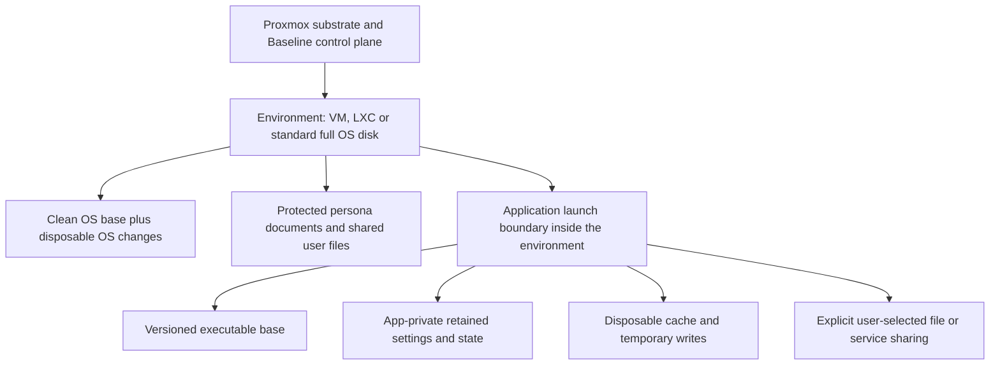

# Application and whole-OS overlay audit — 2026-10-01

Scope: requested audit of each application's isolation/overlays and one overlay for the whole OS. Reviewed current source, layer plans, queues, service wiring and DR117–118 evidence. This is a source/plan audit with pure reproductions and guarded tests, **not a new live confinement or bare-metal verification**. Companion decision: DR119.

## Operator-specified influences — 2026-10-02

The operator names **NixOS, QubesOS, GrapheneOS and Red Hat Project
Hummingbird** as the design influences. Baseline's intended interpretation:

- NixOS: reproducible, versioned executable bases and deliberate generations.
- QubesOS: separate workload boundaries and explicit sharing between them.
- GrapheneOS: phone-style app identities, private state and explicit permissions.
- Red Hat Project Hummingbird: minimal container application bases.

These are design influences, not claims that Baseline implements these projects'
mechanisms or guarantees. Use existing tools where practical; prove application
launch isolation and retained state independently of the whole-OS overlay.
The applied lifecycle remains queue74. No new runtime verification is implied.

## Finding

Baseline has working guest OS clone/rebuild mechanisms, but **no applied per-application isolation lifecycle**. Fifteen catalog-derived app plans contain seven declared overlay mounts and three container binds. All report `AppPlan.isolated=True` and no exact target conflicts. That proves generated path conventions only. It does not establish ownership, mounts, confinement, application inventory completeness or recovery.

Whole-OS and application isolation must be separate operations. A disposable VM/LXC root plus retained home lets an environment rebuild. Apps inside that environment still share its normal filesystem and user permissions. Conversely, per-app data overlays cannot preserve the whole OS installation or replace its boot/update mechanism.

## Findings, evidence and consequences

| Priority | Finding and source | Consequence / required next increment |
|---|---|---|
| P0 | `/app-isolation` reported “Isolation holds” using `all(p.isolated)`; `AppPlan.isolated` checks string prefixes/mode text only (`baseline_web.py:render_app_isolation_page`, `appdata.py:AppPlan`). | Corrected to “Plan checks passed” with explicit runtime unverified notice. Do not use this planner as a launch authorization or a runtime badge. |
| P0 | No app apply/launch/reset/uninstall transaction: `appdata.py` is pure, `boot/provision.sh` copies it only; `required_directories` just returns strings. | No account allocation, registry creation, mount, data migration or sandbox exists for these plans. Build one app end-to-end before declaring all catalog apps isolated. |
| P0 | Host packages run directly; data overlays are mount specifications, not process confinement (`MEDIA[KIND_PACKAGE]`). `plan_for` sets `lowerdir=target`, including unresolved `~` paths. | OverlayFS redirects writes only at mounted targets. It neither makes the original package installation immutable nor stops access elsewhere. Resolve paths for the actual user, preserve a distinct lower snapshot, mount within the app's launch namespace, and verify writable/readable surfaces. |
| P0 | `quadlet.non_persistent_volumes` accepts `/mnt/BASELINE/app:/data`; it tests names, not actual mounts/identity. Pure reproduction returns no flagged volume. | An app could put retained state on the disposable volume or an unmounted root-directory fallback. Runtime provisioning needs a mounted-volume/storage-class check, canonical paths and actual ownership. This defect is recorded, not repaired by this audit. |
| P1 | Unknown catalog app data targets default to `()` (`installable_apps`, `DATA_TARGETS.get`). Only a small manually maintained list is inspected. | Missing declarations were represented as “no persistent data.” Page now says “no declared data targets”; unlisted paths are unaudited. Distinguish unknown, verified stateless and explicitly declared state. Include caches, settings, credentials, extensions, documents, logs and services' machine state. |
| P1 | `_escape_target('~/a-b') == _escape_target('~/a/b')`; `target_conflicts` checks only identical targets, not nested paths; `cross_app_leaks` checks only string nesting. | Distinct targets can reuse upper/work directories; parent/child mounts can hide state. Use collision-free target identity, canonical resolved paths, disjoint upper/work/lower and nesting checks before applying. Current shipped catalog has no exact collision; this is a planner capability defect. |
| P1 | App-specific rootless UID is named but not created. `container_spec` requests it; Quadlet resolves it with getent and refuses absence. User service bus, subuid/subgid and boot lifecycle aren't provisioned. | Rootless unit generation is not a running application. Provision non-login service identities (not guest human accounts), persistence ownership and user-service lifecycle before starting. Host rootless identity is distinct from the image process's User; both need checking. |
| P1 | Caddy only: three declared binds, digest pin, rootless plan. Quadlet default remains rootful; container writable image-layer storage isn't configured per app; generated unit has no read-only root setting. | Own binds do not capture every write. Decide whether image-layer writes are disposable; put required state in explicit persistent binds. Define read-only image root plus explicit temp writes where compatible; isolate the Podman storage lifecycle from resettable OS storage. Pinning bytes does not verify publisher trust. |
| P1 | Caddy publishes `8080:8080`, `8443:8443` without host IP; generic ContainerSpec supports unrestricted network/binds/devices and its fields are not all validated like NetworkSpec. | These generic primitives don't enforce the app contract. Define local/SSH access and explicit service sharing; validate unit fields and reject undeclared bind/device/network access in the app apply boundary. GPU/passthrough intentionally changes isolation and must be declared. No runtime policy proof here. |
| P1 | Flatpak/Snap/AppImage/Nix have medium descriptions, no installation/app-data adapters. Flatpak permission grants vary; Nix runtime has no automatic sandbox; Snap current is a revision symlink. | Preserve each medium's real confinement, inspect effective permissions and data conventions; don't claim every medium brings identical isolation. Resolve symlinks safely across updates; test app-specific revision/state migration. |
| P1 | VM home and LXC home/root/data retained globally per environment (DR117–118), no guest per-app adapter. LXC binds are excluded from vzdump. | Data survives an OS reset, but applications inside a guest can still share home/state. Guest app isolation must run inside that guest or use app-specific containers/VMs; backup both retained state and clean-base metadata with verified restore. |
| P1 | `/mnt/APPDATA_ADMIN` and `/mnt/APPDATA_PERSONAL` plans exist, but the known physical Baseline layout has six partitions, no APPDATA volumes. | No physical apply target is currently established. External selected mounted storage must be supported; don't repartition persistent user data as an incidental app install. |
| P2 | `registry.db` is planned inside app-owned writable tree; allocated IDs are previews unless explicit naming allocation occurs. | Keep trusted control-plane identity/permissions outside app-writable state. App-private metadata may stay there. Separate immutable identity, versioned recipe, executable base and mutable data. |

## Whole-OS overlay status

| Environment | Present mechanism | Limit |
|---|---|---|
| Bare-metal Proxmox substrate | Installed mutable Debian/PVE root; selected control-plane bind redirects and firstboot gates | No persistent production whole-root OverlayFS layer. Disposable-drive reinstall is recovery, not every ordinary OS change. Kernel/initramfs/EFI/PVE service updates need their own boot-compatible workflow. |
| DR117 disposable proof host | QEMU qcow2 overlay over read-only physical backing | Test containment below the virtual disk, not an overlay deployed on the bare-metal source. Do not present it as production host rollback. |
| Ubuntu VM | Immutable qcow2 base, disposable OS overlay and separate retained home; real clean rebuild/profile retention in KVM | Whole OS reset supported within tested recipe; home itself is not per-app confinement. Guest agents and package/bootstrap paths are part of readiness. |
| Ordinary ISO VM | Full protected system disk, installation/freeze/base/overlay workflow | Full disks remain legitimate. Requested distro installs and their retained mount setup unverified. UEFI boot state and external disks must be covered before promising complete rollback. |
| Native LXC distro | Immutable template plus native thin linked root, retained home/root/data; actual Proxmox-in-KVM proof for 11 families | Shares host kernel; no isolated distro kernel, no guest-app confinement. ZFS proof and bind-data restore remain open. |
| OCI app | Image layers plus runtime writable layer and app binds; Quadlet generation | Image filesystem layering is not a proved Baseline app persistence/reset lifecycle. No new live Podman run in this audit. |

## Target relationship and next functional increments

Treat this as the audited target relationship, not an implemented universal adapter. A single OS overlay supplies normal OS behavior; each application's private state and access rules sit inside that environment. Shared documents are granted intentionally, not copied into every app's private tree. The substrate stays the management layer; it must not become the shared daily-driver application filesystem.

1. First app: pick Chromium in the tested Ubuntu environment. Allocate stable ID; establish selected mounted AppData storage; create/migrate only its profile; launch with an actual boundary; prove real profile writes land there. Do not change the substrate kiosk profile and daily-driver profile interchangeably.
2. Prove two applications: cross-app reads/writes denied, explicit shared document works, unknown data location produces an honest refusal. State survives clean OS rebuild. Reset only one app's disposable settings snapshot without deleting user documents or the other app's data.
3. Version and recovery: retain app recipe/base version, trial upgrades in new disposable state, test migrations, crash/restart and rollback compatibility; stopping/uninstalling preserves protected data. Separate backup/restore proves recovery independently of overlay reset.
4. Add OCI/Flatpak adapters after one end-to-end path; AppImage/Nix need a launch sandbox. Expand guest adapters only with evidence per medium/distro. Keep standard full disks available.
5. Scope production substrate OS rollback separately: bootable candidate generation, EFI/kernel/initramfs compatibility, PVE state compatibility, explicit promote/rollback and power-loss recovery. No bare-metal root-overlay retrofit is authorized or claimed by this audit.

Queued as v0.2 row74; existing access approval row42, backup row60, deployment row72 and distro row73 remain open. No new physical actions or credential handling were needed for this audit.

## Primary references

- [Linux OverlayFS](https://docs.kernel.org/filesystems/overlayfs.html): filesystem merging, work/upper requirements and permission model; not an application access policy.
- [Podman Quadlet](https://docs.podman.io/en/latest/markdown/podman-systemd.unit.5.html): actual generated-service, rootless, mount/network and container options.
- [Flatpak permissions](https://docs.flatpak.org/en/latest/sandbox-permissions.html): effective filesystem and service access depends on permissions.

These support mechanism distinctions; findings about Baseline come from the current repository. Historical records remain history; current layer docs and INSTALL have been corrected to avoid claiming live application isolation.

## DR125 follow-up — 2026-10-02

Collision-free encoded target keys, lexical unsafe-target refusal and nested/
equivalent conflict reporting are implemented and unit-tested. Earlier finding
rows describe the audit baseline; those path-planner gaps are now narrowed.
Unknown/stateless declarations, runtime canonical/symlink resolution, mounted
storage and all applied app lifecycle/confinement remain open. No runtime or
physical verification was performed by this follow-up.
