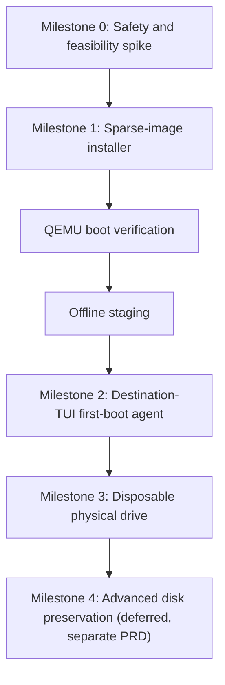

# PRD: BaselineOS Drive Setup GUI v2 — bootable install + first-boot configuration

Status: draft (revised — see §0 changelog)
Owner: Cliff Thelin
Depends on: `packaging/baseline-drive-setup/` (v1, shipped as `.deb`), `baseline/lib/handoff.py`, `baseline/bin/baseline-setup-wizard`

## 0. Revision changelog

**Milestone 0 update (Investigation 5, post-revision-2)**: §5.8 rewritten. The original chroot-vs-`systemd-nspawn` offline-containment question is closed as `defer-to-first-boot`, verified directly against a disposable overlay of the real installed image (Investigation 3/4's pipeline) — no offline package installation, no containment mechanism, exists anywhere in this design. Packages install once, during the destination-hardware first-boot stage, against a real running systemd. See `decision-records/05-offline-staging-containment.md`.

**Revision 2** (this one) closes a second review pass. Architecture and milestone direction are approved; the remaining problems were narrower but load-bearing:

- The PRD assumed a first-boot systemd unit could make consequential network/firewall/tether/restore decisions unattended, then separately required the user confirm the detected subnet — those two statements can't both be true once the Ubuntu-hosted GUI is gone and the drive is booting on its own. §5.6 now specifies a real destination-hardware first-boot TUI on Baseline's own tty1 that does the confirming, with a defined handoff contract from the installer GUI.
- "Independently proven disposable" and "genuinely blank" overstated what signature inspection can show. Renamed throughout to technical-eligibility language with explicit states (§5.3, §6) and a separate, unmerged concept of user attestation.
- `flock` was asserted as exclusive-access protection; it's advisory only. §5.1a now marks the locking mechanism **unresolved, to be proven at Milestone 0**, and requires `by-id`/serial/WWN identity — `by-path` alone is no longer sufficient.
- Backend selection previously lived behind one runtime-configurable abstraction. §5.4 now requires the physical-device capability be **structurally absent** from the Milestone 0–2 helper binary and polkit action, not gated by a flag or a milestone check at runtime.
- "Partial-apply impossible by construction" for handoff restore was incorrect — validation-before-apply doesn't protect against power loss, filesystem failure, or a later category failing after an earlier one committed. §5.12 now specifies a transactional model with a durable journal and an explicit `partial_state_requires_attention` outcome.
- Added: chroot/offline-install containment requirements (§5.8), firewall application as a transactional, rollback-timer-protected action with a full standalone-host traffic account (§5.9), and treatment of the prepared answer-file ISO as sensitive material with its own Milestone 0 questions (§7.1).
- Assorted corrections: sysfs `holders`/`slaves` vs. relying solely on `lsblk`'s `HOLDERS` column; USB-disconnect-mid-write is "indeterminate + bounded termination," not "aborts"; automount interference needs active mitigation, not an assumption that a holder check prevents it; firewall unit tests must exercise the actual generated config format; host-key restoration validates private key, public key, *and* directory permissions.

**Revision 1** replaced the first draft's unbacked guarantees (device-name confirmation, "untouched on failure", chroot-validated networking, LAN-connect-proves-global-inaccessibility) with mechanism-honest language and introduced the milestone sequence. See git history for that diff if needed; this document supersedes it.

## 1. Problem

v1 of `baseline-drive-setup` (the `.deb`, shipped this session) solved *authorization* — a GTK4 app that picks a drive and runs a privileged helper through `pkexec`, no custom sudo, no scary install commands. It does **not** solve *installation*: `qemu-install` boots the raw Proxmox ISO with `-nographic -serial mon:stdio`, which the graphical Proxmox installer cannot drive, so nothing actually completes. Everything past drive selection — a bootable Proxmox install, the five diagnostic tools, LAN-scoped Proxmox web UI, SSH/tether preconfiguration, and handoff-packet restore — is either missing or lives in a disconnected CLI tool (`baseline-setup-wizard`) the GUI never invokes.

This PRD defines a production-quality installer **framework** whose destructive backend is structurally limited to image files through Milestone 2, and whose consequential real-world decisions (network, firewall, tether, secret restoration) are always confirmed by a human at the console that can actually see the real hardware — never inferred by unattended code running somewhere the human isn't looking.

## 2. Governing architectural principle

> "As much of the setup process as we can should be made available while a full OS is in place, not automating CLI scripts between TUI pages." — user, 2026-09-20

"A full OS is in place" now has a precise meaning in this document: **the target's own first boot on destination hardware**, with Baseline's existing tty1-ownership model (established earlier in this project) presenting a real, human-facing TUI — not a systemd unit making silent choices, and not the Ubuntu-hosted installer GUI, which no longer exists once the drive is booted on its own.

## 3. Goals / Non-goals

**Goals**
- A user with a technically-eligible image, virtual disk, or (at Milestone 3) whole physical drive can go from "GUI open" to "drive boots Proxmox, configured" with no manual TUI navigation *of the Proxmox installer*, while still explicitly confirming every consequential, hardware-dependent decision at the point where real facts exist.
- Every privileged action stays behind `pkexec` + a polkit action scoped to exactly what that milestone permits; "show me the script" is a redacted execution plan / config diff, never a secret-bearing command.
- Every step that can destroy data requires a stable-identity confirmation the helper independently re-verifies immediately before the write, plus an explicit user attestation — never a technical signature check alone, and never a bare device path.
- Local-network-only Proxmox web UI access is the default, applied as a rollback-protected transaction, with claims worded to match exactly what was tested.

**Non-goals (this PRD)**
- No support for installing alongside an existing OS on the same disk, preserving partitions, shrinking filesystems, dual-boot, installing into free space, or reusing an existing EFI partition — Milestone 4, deferred, needs its own risk model.
- No remote/headless operation over SSH — local GUI for Phase 1/offline staging; local TUI on the target itself for first boot.
- No cross-major-version Proxmox handoff restore, and no automatic restoration of private key material regardless of version match (§5.12).
- No physical-device support of any kind before Milestone 3 — see §5.4 for what "structurally absent" requires.

## 4. Destructive-target policy

Destructive installation is permitted only against:

1. Sparse/raw image files created by this tool in its own controlled workspace.
2. Virtual disks (QEMU-backed), same mechanism as (1).
3. At Milestone 3 only: a whole physical drive that has passed every technical-eligibility check in §6 **and** received explicit user attestation — the tool proves technical facts about the drive, never the user's intent toward its contents; that judgment stays with the user, stated plainly, not implied by a "disposable" label.

Nothing in this tool preserves existing partitions or installs beside existing data in this version.

## 5. Functional requirements

### 5.1 Drive selection and stable identity

`/dev/sdX` paths are not authorization-grade — unstable across reconnection, reboot, enumeration order. The GUI and helper key off:

- `/dev/disk/by-id/...`, preferring a WWN or serial-derived identifier
- Manufacturer, model, capacity
- Serial/WWN itself, not just the `by-id` symlink name
- Connection type (USB/SATA/NVMe)
- Existing partition-table/filesystem signature state (§5.3)
- Mounted/in-use status, including sysfs-derived `holders`/`slaves` relationships (§5.1a)

**`by-path` alone is not identity** — it names a connection point, and a different physical drive inserted into the same port would resolve to the same `by-path` entry. A physical drive with no serial, WWN, or other content-independent unique identifier is **ineligible for destructive installation**, full stop — it does not fall back to path-based authorization.

The GUI's confirmation dialog reads back a human-readable identity string, e.g.:

> **ERASE Samsung T7 1TB ending 4C21**

The helper independently rediscovers the device by its stable identity and re-checks capacity, serial/WWN, and storage-graph position immediately before the destructive operation — it does not trust the GUI's earlier snapshot. A mismatch at this point refuses and requires full reselection.

### 5.1a Exclusive access — unresolved at this revision, must be proven at Milestone 0

`flock` is advisory. QEMU, `udisks`, an automounter, or any other process is free to ignore it. This PRD does **not** claim a working exclusive-access design yet. Milestone 0 must determine one, evaluating some combination of:

- Repeated (not one-shot) mount/swap/holder re-checks across the operation's duration, using sysfs `/sys/block/<dev>/holders/` and `/sys/block/<dev>/slaves/` directly — not solely `lsblk`'s `HOLDERS` column, which is a convenience view over the same data and may not reflect every relationship type.
- Host automount inhibition for the duration of the operation (e.g. a `udisks2` inhibit lock or equivalent), with restoration afterward.
- An exclusive block-device open where the kernel/tooling supports it (`O_EXCL`, or `BLKROSET`-style guards as applicable), with the already-open file descriptor passed to the destructive worker rather than reopening the path later.
- Continuous device-presence and identity monitoring for the duration of the write, aborting immediately if a new holder, mount, or identity change appears.

Whichever combination is chosen, cleanup and automount-inhibition restoration must happen on every exit path (success, failure, cancellation, crash). This section is a research task, not a spec — Milestone 0's output is a decision here, recorded as an update to this PRD before Milestone 1 work depending on it begins.

### 5.2 Storage-ancestry exclusion

Excluding only `findmnt -no SOURCE /` is unsafe — that can resolve to an LVM LV, a dm-crypt mapping, a RAID member, or a ZFS dataset, not the physical disk underneath. The helper resolves the **full live-system storage graph** using sysfs ancestry (`holders`/`slaves`, walked recursively — not assumed to be fully exposed via any single `lsblk` column) plus `pvs`/`vgs`, `dmsetup deps`, `mdadm --detail`, and `zpool status`, and excludes every physical ancestor backing:

- `/`, `/boot`, `/boot/efi`
- swap
- any other mounted filesystem
- LVM physical volumes
- dm-crypt mappings
- MD RAID members
- ZFS pool members
- active loop-backed storage
- any device with holders or open dependent mappings

**If the relationship cannot be resolved with confidence, the drive is unavailable for selection — not flagged with a warning.**

### 5.3 Technical eligibility states (replaces "blank"/"disposable")

Software can prove technical facts. It cannot prove the user doesn't care about a drive's contents, and it cannot prove a drive is truly free of recoverable data merely because no known signature is present — a wiped signature can still leave recoverable data behind, and `wipefs`/`blkid` only detect signatures they recognize. The tool therefore classifies every candidate device into exactly one state, computed read-only via `lsblk`, `blkid`, `wipefs --no-act`, partition-table parsing, and the §5.2 ancestry tooling — **never** by mounting a filesystem to inspect its files:

| State | Meaning |
|---|---|
| `no_detected_signatures` | No recognized partition table, filesystem, RAID marker, LVM metadata, or encryption header found. **Not** a claim that the drive is blank or that no data is recoverable — only that nothing recognized was found. |
| `recognized_existing_data` | A recognized signature of some kind is present. |
| `ambiguous_or_unreadable` | Read errors, partial/corrupt signatures, or anything the tooling can't classify confidently. |
| `active_or_ineligible` | Mounted, part of an excluded ancestry graph (§5.2), held by another process, or lacking a stable identity (§5.1). Never selectable regardless of signature state. |

`ambiguous_or_unreadable` and `active_or_ineligible` are never selectable for destructive installation. `no_detected_signatures` and `recognized_existing_data` are both selectable **only** after the user attestation in §6 — the tool does not treat "no signatures found" as requiring a weaker confirmation than "has data." Both require the same erase-phrase confirmation; the eligibility state is shown to the user as information, not used to relax the confirmation requirement.

### 5.4 Backend structure — physical devices structurally absent before Milestone 3

Through Milestone 2, the shipped privileged helper binary and its polkit action **do not have a code path capable of expressing a block-device target at all**:

- The helper's destructive subcommands accept only a path that must resolve, after canonicalization, to a regular file inside a workspace directory the helper itself controls (created by the helper, not user-suppliable) — never a path the caller chose freely, and never anything that `stat` reports as a block device.
- Any argument that resolves to a block device is rejected by type-check before any other validation runs.
- The polkit `.policy` file shipped through Milestone 2 authorizes only the image-backed action ID; no `os.baseline.drive-setup.*physical*` action exists in the shipped package.
- No `--physical`, `--device`, or equivalent dormant flag exists in the helper's argument parser, even disabled or unwired.
- Milestone 0–2 tests include an explicit **surface test**: enumerate the helper's accepted subcommands and argument shapes and assert none of them can be made to accept a block-device path, by construction (a static assertion over the argument schema, not just a runtime behavioral test).

At Milestone 3, physical-drive support is added as a **separately reviewed** new helper capability and a new, separately scoped polkit action — a genuine new security boundary, reviewed on its own, not an existing flag or milestone check flipped on.

### 5.5 Unattended install (Phase 1, image/virtual-disk backend only through Milestone 2)

- GUI form collects only what the Proxmox installer answer file needs: hostname, initial root password (see §7.1 for why this is treated as sensitive material through the whole pipeline), timezone, keyboard layout, network = DHCP. Static IP, firewall, SSH, and tether are first-boot concerns (§5.6).
- Helper subcommand `automated-install` generates a TOML answer file via `proxmox-auto-install-assistant prepare-iso`, producing a self-contained unattended ISO, then boots it under QEMU against the image/virtual-disk backend with a real display (`-vnc` or `-display gtk`), not `-nographic`.
- **Failure contract:** once the installer begins, it may erase or partially rewrite the target before failing. The tool states:

  > "The previous attempt may have modified this target. It is not known to be in its original state."

  A retry rediscovers and revalidates the same stable device identity from scratch, displays the "may have been modified" notice, and requires fresh destructive-authorization confirmation. **Retry never begins automatically.**
- Firmware mode (UEFI vs. legacy BIOS) is an explicit, recorded choice — see §5.7.

### 5.6 First-boot configuration — offline staging + destination-hardware TUI

This is the section the prior revision got structurally wrong: it described a first-boot systemd unit configuring network/firewall/tether/restore decisions automatically, while separately requiring the user confirm the detected subnet. Once the Ubuntu-hosted GUI is gone — which it is, the instant the new drive boots on its own — there is no GUI left to ask that question. The confirmation has to happen somewhere real, and the only place that exists is the target's own console.

**Offline staging** (no chroot, no package installation — see §5.8; this stage only copies files):
- Copy Baseline.
- Stage the handoff packet's non-secret categories into a quarantine location (not yet applied — see §5.12).
- Seed authorized public keys into a staged location.
- Install and enable a Baseline **first-boot state machine** unit, and a **signed/validated setup-intent bundle** produced by the installer GUI containing: the operator's Phase-1 form choices, which handoff categories were selected for staging, whether SSH/tether preconfiguration was requested and with what values, and nothing secret in plaintext beyond what's unavoidable (staged handoff secrets stay encrypted at rest until the destination TUI supplies the passphrase).
- **The five diagnostic tools are explicitly not installed at this stage** — see §5.8.

**Destination-hardware first boot** (the target itself; a QEMU boot of this stage is a proof exercise for Milestones 1–2, explicitly not claimed equivalent to real hardware):
- Baseline's first-boot state machine owns tty1, exactly as Baseline already owns tty1 in normal operation. **tty2 remains available throughout** — this is not a mode that locks the operator out of anything.
- The unit may perform **fact discovery** automatically and silently: real NIC names, link state, DHCP lease/subnet, USB device presence, present storage. Discovery has no side effects and requires no confirmation.
- Every **consequential** decision — applying network configuration, applying the firewall policy, applying tether configuration, applying any handoff-restore category, especially anything from the private-key tier in §5.12 — is presented on tty1 as a real, human-facing TUI screen showing the discovered facts and the proposed action, and requires explicit local confirmation or correction before it is applied. This mirrors the setup-intent bundle from offline staging: the bundle proposes, the TUI confirms.
- Each consequential action, once confirmed, is applied through the bounded, rollback-protected mechanisms specified elsewhere in this document (§5.9 for firewall, §5.12 for handoff) — the TUI is the confirmation surface, not a new application mechanism.
- After the full sequence completes (or the operator explicitly defers a step), Baseline records **first-boot completion** in a durable marker. The state machine does not re-run automatically on subsequent boots; a deferred or re-run pass requires an explicit operator action from within Baseline's normal running state, not an automatic re-trigger.

**Post-boot verification** (back on the GUI-running machine, or reported by the completed first-boot state machine): confirm the five tools installed and idle, confirm applied network config, confirm firewall state matches what was confirmed on tty1, confirm Baseline is running, confirm tty1/tty2 behavior, confirm storage/recovery paths intact.

The GUI never claims LAN access or tethering "works" on the strength of a QEMU session or chroot alone — those claims are only made after the destination-hardware TUI stage reports a *confirmed and verified* result.

### 5.7 Bootability verification

Two independent checks:

1. **Static verification** — partition table matches expectation, root filesystem/LV present, Proxmox packages installed, ESP or BIOS-boot structures present, bootloader files present, `fstab` valid, Baseline first-boot unit and setup-intent bundle staged.
2. **Actual QEMU boot test** — boot from the installed target, require a deterministic success marker via serial or guest-agent output, shut down cleanly.

Firmware mode is tracked explicitly: an install under virtual UEFI may write only to virtual NVRAM, which doesn't exist on destination hardware. The disk needs a portable/fallback EFI boot path (`/EFI/BOOT/BOOTX64.EFI` or equivalent) validated as part of static verification, not assumed.

**Passing the QEMU boot test proves the disk is structurally bootable. It does not prove destination hardware will boot it.** That claim is only made after §5.6's destination-hardware first boot completes and is confirmed.

### 5.8 Package installation — deferred to first boot, not staged offline

**Decision (Milestone 0, Investigation 5): package installation is never done offline.** No chroot, no `systemd-nspawn`, no offline containment mechanism of any kind exists in this design. Offline staging (§5.6) copies files only — Baseline itself, the setup-intent bundle, the first-boot unit, staged (unapplied) handoff/key material. Every package Baseline needs, including the five diagnostic tools (§5.9), installs during the destination-hardware first-boot stage (§5.6), via a normal `apt-get install` against the real, running target OS with a real systemd — the same environment and mechanism any normal Debian/Proxmox system uses for its own package management, with no synthetic sandbox standing between the package and the service manager it expects.

**Why, with evidence**: the original plan required choosing between chroot+`policy-rc.d` and `systemd-nspawn` for offline containment, with the safety property resting on "maintainer scripts can't start services because there's no reachable systemd." Investigation 5 found that reasoning insufficient on its own — a maintainer script can invoke binaries directly, manipulate devices, or depend on mounted host interfaces in ways "systemd isn't PID 1" doesn't cover — and, separately, found that verifying either containment approach on a real development host requires real root, which this project's own architecture deliberately doesn't grant to interactive tooling. Rather than requesting sudo credentials or building a privileged mounting helper to force the comparison, the gap was read as the actual answer: if package installation is going to happen where a real systemd is genuinely running anyway, do it there, once, in the environment the packages already expect — not twice, once fake and once real. This was verified directly, not assumed: the five packages were installed against a disposable overlay of the actual installed image, with listening sockets captured before and after (identical), `iperf3` confirmed `disabled`/`inactive` both immediately after install and again after a full reboot, `dpkg --audit` clean, and no `sensors-detect` or SMART self-test triggered. Full evidence in `docs/design/decision-records/05-offline-staging-containment.md`.

**What this changes structurally**:
- No `policy-rc.d`, no bind-mounted `/proc`/`/sys`/`/dev`, no chroot/nspawn code path exists anywhere in the shipped tool.
- The setup-intent bundle (§5.6) carries the package *selection*, not installed packages — the destination-hardware first-boot stage performs the actual install as one of its confirmed, consequential actions.
- The distinction the prior revision required ("package installed offline" vs. "capability verified on destination hardware") is now moot — there is only one installation event, and it already happens on destination hardware, so there is only one claim to make: installed and verified, together.
- Package-database consistency (`dpkg --audit`) and the `iperf3`-listener check both happen at the same point, post-install on destination hardware, not split across an offline stage and a later verification stage.

### 5.9 Five diagnostic tools

Fixed set, no per-tool opt-out: `lm-sensors`, `nvme-cli`, `smartmontools`, `iperf3`, `ethtool`. Installed noninteractively (`DEBIAN_FRONTEND=noninteractive`) during the destination-hardware first-boot stage (§5.6), not offline (§5.8). No `sensors-detect`, no triggered SMART self-tests — confirmed directly in Investigation 5 (no `sensors3.conf` regenerated, no self-test log entries). `iperf3`'s listener/enabled state is verified once, post-install, on destination hardware — confirmed `disabled`/`inactive` in testing, both immediately after install and after a full reboot. `smartmontools` may already be present as part of Proxmox's own base install (confirmed in testing) — the install step must tolerate that (already-installed is not a failure) rather than assuming a clean slate.

### 5.10 Proxmox web UI firewall — transactional, rollback-protected

A malformed firewall policy can cut off the very access being used to verify it. Firewall application follows the same shape as a network-config change, not a fire-and-forget rule push:

1. Preserve the current rule set (so it can be restored verbatim).
2. Validate the proposed IPv4 and IPv6 policy against the schema of the **detected, installed Proxmox version's actual firewall engine** — not a hardcoded assumption about which engine/version is present.
3. Show the complete proposed policy on tty1, as part of the §5.6 destination-hardware confirmation step — every rule, every interface, both address families, not just the allowed-subnet line.
4. Arm an independent rollback timer before applying.
5. Apply.
6. Verify allowed LAN access to :8006 **and** every locally-required service (see traffic account below).
7. Cancel the rollback timer only on verified success.
8. If verification fails or the timer expires first, restore the preserved rule set automatically.

**Traffic account** — the policy is built to keep the host actually functional as a standalone Proxmox node, not just to open :8006:
- DHCP client traffic
- DNS
- IPv6 neighbor discovery and router advertisements
- ICMP/ICMPv6 required for correct IPv6 operation
- Loopback
- Established/related traffic
- SSH, if enabled
- Baseline's own local communication needs
- Only the Proxmox services actually required for **standalone** operation

**Cluster traffic is not pre-opened "for the future."** This installer targets a standalone host; enabling cluster membership is a later, separate policy transition with its own review, not bundled into initial setup.

What the tool claims after this process, worded precisely: **"allowed from the confirmed subnet, denied by host policy elsewhere."** Not "globally unreachable" — no external-vantage-point probe exists in this design to back that stronger claim.

### 5.11 SSH preconfiguration

Unchanged in substance from prior revision: independent of handoff restore; GUI offers public-key import and a password-auth toggle (default disabled once a key is present); if handoff public keys are also selected, handoff keys apply first, GUI-entered keys append, never silently overwrite. SSH host/user private keys are handled under §5.12's tiered model, not here. Application of this configuration happens at the destination-hardware TUI stage (§5.6) like every other consequential action.

### 5.12 Tether preconfiguration

Unchanged in substance: offline staging records intent only (interface alias if known from a handoff packet, preferred-vs-fallback choice); the real interface only exists once the real USB device is present on the real machine, so application and validation happen at the destination-hardware TUI stage. Implementation target (systemd-networkd vs. `/etc/network/interfaces.d/`) must be confirmed against what `boot/provision.sh` actually assumes elsewhere in this repo before implementation.

### 5.13 Handoff packet restore — tiered trust, transactional application

Trust tiers unchanged from prior revision:

| Category | Default |
|---|---|
| Baseline configuration | Selectable, on by default |
| Baseline non-secret state | Selectable, on by default |
| Authorized public keys | Selectable, on by default |
| SSH host private keys | **Off** — exceptional-continuity case, second explicit warning |
| Root/user private keys | **Off** — strongly discouraged, second explicit warning |
| Machine identity (`/etc/machine-id`, hostname) | **Never restored automatically** |

Duplicate-host-identity risk from restoring shared host keys is stated explicitly in the second warning.

**Application model corrected.** "Validate all before applying any" prevents validation-time partial changes; it does **not** protect against power loss, filesystem failure, a permission-setting failure, or a later category failing after an earlier one already committed. Restoration is therefore a transaction with a durable journal, not a claim of atomicity across unrelated filesystems and services:

1. Validate all inputs (integrity, schema version, Proxmox-major-version, path-traversal/symlink checks, size/decompression-bomb limits).
2. Back up every destination path that may change.
3. Stage replacement files on the destination filesystem (same filesystem as the eventual target, so the next step can be atomic).
4. Apply each category through atomic rename where the filesystem supports it.
5. Record each completed transition in a durable, on-disk journal as it completes — not only at the end.
6. If a later category fails, roll back every already-completed transition using the journal, in reverse order.
7. Independently verify the post-rollback (or post-success) state matches what was intended — file contents, ownership, and mode, not just presence.
8. If complete rollback cannot be proven (e.g. a backup itself failed to restore), report **`partial_state_requires_attention`** and stop — never silently present a mixed state as either "succeeded" or "cleanly failed."

Additional integrity requirements: authenticated packet integrity (AEAD or a signed manifest hash, not just "decrypts"); schema-version compatibility independent of the Proxmox-major-version check; size/extraction limits; path-traversal and symlink protection on every extracted entry before it touches the filesystem; exact ownership/mode validation on restored files. For SSH host-key restoration specifically, validate the **private key, the matching public key, and the containing directory's permissions** as three separate checks — not `600 root:root` on the private key file alone.

Application of selected categories happens at the destination-hardware TUI stage for anything from the private-key tier (per §5.6); non-secret categories may apply during offline staging since they carry no equivalent real-hardware dependency, but still go through the same journaled/transactional mechanism above.

### 5.14 Prepared ISO — treated as sensitive material

See §7.1.

### 5.15 "Show me the script" (extends v1)

Covers every action from Phase 1 through the destination-hardware TUI stage. Output is a redacted execution plan / configuration diff, never a secret-bearing command line, per §7.

## 6. Technical-eligibility gate (Milestone 3 physical-drive gate)

Renamed from "disposability proof" — the tool proves technical facts, not the user's intent toward the drive's contents. A physical drive becomes eligible for destructive installation only once, in sequence:

1. Stable identity resolved with a real serial/WWN (§5.1) — no serial/WWN, no eligibility, regardless of other checks.
2. Technical eligibility state computed (§5.3): must be `no_detected_signatures` or `recognized_existing_data`; `ambiguous_or_unreadable` and `active_or_ineligible` are never eligible.
3. Full storage-ancestry exclusion passes (§5.2) with no ambiguity.
4. Exclusive-access mechanism from §5.1a engaged and continuously re-verified.
5. **Explicit user attestation**, worded to state what it actually is — the user's own judgment that this drive's contents may be destroyed, not a system-generated "disposable" verdict. Erase-phrase confirmation naming the stable identity, e.g. "ERASE Samsung T7 1TB ending 4C21."
6. Helper re-discovers and re-validates identity/capacity/ancestry one last time inside the privileged context, immediately before the write begins.

Any failure at any step aborts with no partial action. A device that reaches step 6 and is then interrupted (USB disconnect, power loss, crash) is reported as **indeterminate**, not "aborted cleanly" — see §8.5.

## 7. Security requirements

- No hardcoded secrets. Passwords/passphrases never placed on any command line (visible via process listings). They cross the `pkexec` boundary via stdin or an inherited file descriptor, or a root-only `tmpfs` file at `0600`, created immediately before use and unlinked on every exit path (success/failure/signal/cancel), only if the answer-file mechanism requires a path (§7.1 — confirm this against the actual schema, don't assume).
- All GUI/TUI inputs validated against an explicit allow-list before interpolation into any shell command or config file.
- Helper subcommands take fixed, schema-validated argument shapes — never a free-form string executed as-is (§5.4's surface test extends this to a static guarantee, not just a runtime check).
- Firewall rule generation is unit-tested against the **actual generated configuration format** for the detected Proxmox firewall engine — not merely asserted to lack the string `0.0.0.0/0`, which would pass a rule that's broken in some other way.
- Handoff failures fail closed per §5.13's transactional model, including the explicit `partial_state_requires_attention` outcome when full recovery can't be proven.
- Error messages / "show details" panels never leak passphrase or password values, including in stack traces and crash output.

### 7.1 The prepared answer-file ISO is itself sensitive

Even if the temporary answer-file/secret-delivery mechanism above is handled correctly, the **prepared unattended-install ISO** that `proxmox-auto-install-assistant prepare-iso` produces may embed the answer file, and therefore potentially embed password material, inside the ISO itself. This needs its own Milestone 0 findings, recorded before Milestone 1 work depends on the answer:

- Does the answer-file schema accept a pre-hashed password, or does it require plaintext?
- What exactly ends up embedded in the prepared ISO?
- Does the prepared ISO constitute reusable authentication material if someone else obtains it?
- Where is the prepared ISO stored, for how long, and is it safe to reuse across multiple installs (likely not, if it contains a fixed credential)?
- What is the cleanup behavior after a crash or reboot mid-process — is a stale prepared ISO with embedded secret material left behind?

If plaintext embedding turns out to be unavoidable given the tool's actual schema, the design uses a **generated one-time credential**, not the user's real intended password, and **requires rotation on first boot** before the destination-hardware TUI stage is considered complete. Deleting the ISO from SSD storage afterward is described as *deletion*, not *secure erasure* — SSD wear-leveling means the underlying flash cells aren't reliably overwritten by a simple unlink, and this document does not claim otherwise.

## 8. Testing strategy (TDD)

Per the project's testing rules: 80% minimum coverage, unit + integration + e2e, red-green-refactor, AAA structure.

### 8.1 Unit tests (Python, `pytest`, `FakeRunner` pattern from `tests/unit/inventory_tests/`)

`tests/unit/drive_setup_tests/`:
- `test_answer_file.py` — TOML structure from a form dict; rejects invalid hostname/password before the validator exists.
- `test_firewall_rule.py` — generated rule set exercised against the **actual target config format**, not string-absence checks alone; never emits `0.0.0.0/0`/`::/0`; covers IPv4+IPv6, multiple interfaces, established/related, loopback, DHCP/DNS/ICMPv6-ND passthrough; malformed/oversized subnet input raises; cluster-traffic rules are never present by default.
- `test_storage_ancestry.py` — root-on-plain-partition, root-on-LVM, root-on-LUKS-on-LVM, root-on-MD-RAID, root-on-ZFS-pool-member all resolve to full ancestor exclusion via sysfs `holders`/`slaves` walking (not just an `lsblk` column mock); unresolvable relationship excludes rather than warns.
- `test_eligibility_states.py` — every recognized signature type maps to `recognized_existing_data`; zero-signature/zero-partition/zero-holder/zero-mount maps to `no_detected_signatures` (and the test asserts this state is never rendered to the user as "blank" or "safe"); read errors/partial signatures map to `ambiguous_or_unreadable`; mounted/held/no-stable-identity maps to `active_or_ineligible` regardless of signature state.
- `test_stable_identity.py` — same model+capacity but different serial is rejected; a device with no serial/WWN is rejected regardless of `by-path` resolution; a `by-id` path resolving to a different device than at selection time is rejected.
- `test_backend_surface.py` — enumerates the helper's full argument schema and asserts, statically, that no accepted shape can resolve to a block-device path pre-Milestone-3 (the structural-absence guarantee from §5.4).
- `test_handoff_transaction.py` — against `FakeRunner`/temp dir: wrong passphrase raises; manifest/schema mismatch raises; path-traversal/symlink entries rejected before touching the filesystem; decompression-bomb-sized archive rejected; a simulated failure in category 2 of 3 triggers rollback of category 1 via the journal, and post-rollback state is independently re-verified; a simulated rollback failure produces `partial_state_requires_attention`, not a false "success" or "clean failure."
- `test_ssh_key_ordering.py` — merged `authorized_keys` preserves handoff keys first, appends new ones, no duplicates.
- `test_ssh_host_key_restore.py` — validates private key, matching public key, and directory permissions as three independent checks.
- `test_secret_handling.py` — no code path places a password/passphrase into a subprocess `argv` list; tmpfs secret file unlinked on every exit path including simulated exception/signal; prepared-ISO content is inspected in a fixture to confirm no unexpected plaintext credential ends up embedded beyond what §7.1's findings say is unavoidable.
- `test_setup_intent_handoff.py` — the signed/validated bundle the installer GUI produces for the destination-hardware TUI round-trips correctly and is rejected if tampered with or malformed.

Example (AAA):
```python
def test_eligibility_no_signatures_is_not_labeled_blank():
    # Arrange
    device = FakeBlockDevice(partition_table=None, filesystems=[], raid_members=[])

    # Act
    state = classify_eligibility(device)

    # Assert
    assert state == EligibilityState.NO_DETECTED_SIGNATURES
    assert "blank" not in render_eligibility_label(state).lower()
    assert "safe" not in render_eligibility_label(state).lower()

def test_handoff_partial_failure_reports_requires_attention():
    # Arrange
    journal = FakeJournal()
    categories = [ok_category("baseline-config"), ok_category("public-keys"),
                  failing_category("ssh-host-keys")]

    # Act
    result = apply_handoff_transaction(categories, journal)

    # Assert
    assert result.outcome in (Outcome.SUCCESS, Outcome.PARTIAL_STATE_REQUIRES_ATTENTION)
    if result.outcome is Outcome.PARTIAL_STATE_REQUIRES_ATTENTION:
        assert journal.rollback_attempted_for(["baseline-config", "public-keys"])
```

### 8.2 Unit tests (bash helper, `bats`)
- Stable-identity re-discovery rejects a mismatched serial/capacity immediately before the destructive call.
- Every subcommand rejects a missing/malformed positional arg with no partial side effect before validation completes.
- Block-device-shaped argument is rejected by type-check before any other logic runs (pre-Milestone-3 build).
- Exclusive-access acquisition failure (per whatever §5.1a's Milestone-0 research settles on) aborts cleanly and restores any automount inhibition.

### 8.3 Integration tests
- Full Phase 1 against a throwaway sparse image: answer-file generation → unattended install → static verification → QEMU boot test.
- Offline staging against the resulting image: Baseline, first-boot unit, and setup-intent bundle copied — no package installation attempted at this stage (§5.8).
- Destination-hardware TUI stage, run inside a QEMU VM as a proof exercise (explicitly not claimed equivalent to real hardware): tty1 presents discovered facts and proposed actions, confirmation gate blocks application until acknowledged, tty2 remains responsive throughout, firewall apply/verify/rollback-timer sequence exercised in both the success and induced-failure directions.
- Interrupted-run recovery: kill mid-install, mid-staging, mid-first-boot, and mid-handoff-transaction; assert each resumes only via fresh, explicit authorization, and that a mid-handoff-transaction kill produces either a verified rollback or `partial_state_requires_attention` — never a silent success.

### 8.4 E2E (GUI + TUI)
- Installer GUI: controller/model layer tested directly via `pytest`, plus one `Xvfb` smoke test confirming "Authorize & Build" enables only after the exact erase-phrase naming the stable identity is typed.
- Destination TUI: since this runs on Baseline's existing tty1 infrastructure, extend whatever test harness already covers Baseline's Textual TUI (per `07eda93`/`610fff2` in this repo's history) rather than building a separate one — confirm this reuse is feasible during Milestone 0 rather than assuming it.

### 8.5 Additional cases from review
- Device path changes between GUI selection and authorization — caught by stable-identity re-discovery.
- Same model/capacity, different serial — rejected.
- **USB disconnect after the first destructive write begins**: not describable as "aborts." Specify bounded-time process termination (the destructive worker is killed with a timeout if it doesn't exit on its own) and the target is reported **indeterminate**, matching §5.5's failure contract — never silently treated as cleanly stopped.
- Automount interference: exercised as an active-mitigation test, not assumed prevented by a holder check alone — a test that spins up a fake automount event mid-operation and asserts the operation detects and aborts, given whatever mechanism §5.1a's research settles on.
- Cancellation before vs. after the first destructive write — both leave the tool in the "may have been modified"/indeterminate state.
- QEMU crash after partitioning begins — same indeterminate-state contract.
- UEFI install with no portable fallback EFI entry — caught by static verification.
- Multiple active LAN interfaces — firewall rule covers all of them.
- Firewall rollback timer: induced verification failure triggers automatic restore of the preserved rule set within the timer window.

### 8.6 Coverage target
80% minimum across `baseline/lib/handoff.py`, the new storage-ancestry/eligibility/stable-identity/answer-file/firewall-rule/ssh-merge/transaction-journal modules, the destination-TUI controller layer, and the bash helper's validation logic. GUI/TUI widget wiring is exempted from the numeric target (thin by design), covered instead by the smoke tests in §8.4, which supplement but do not replace the model-layer tests.

## 9. Recommended implementation sequence



### Milestone 0 — Safety and feasibility spike
No physical block-device writes of any kind; no physical-device code path exists to write with (§5.4). Prove:
- The exact `proxmox-auto-install-assistant` answer-file format, and specifically whether it accepts a password hash or requires a plaintext path (§7.1).
- What the prepared ISO actually embeds, and the full set of §7.1's questions.
- Secure secret delivery mechanism works end-to-end, including cleanup on every exit path.
- ISO signature/checksum verification.
- Whether `proxmox-auto-install-assistant` runs on this Ubuntu 26.04 development host at all — unresolved from earlier this session.
- QEMU firmware/boot-mode behavior (UEFI NVRAM vs. portable fallback path).
- Complete storage-ancestry detection logic against real LVM/LUKS/RAID/ZFS test fixtures, via sysfs `holders`/`slaves`.
- **The exclusive-access design from §5.1a — this is a required output of Milestone 0, not an assumption carried into it.**
- ~~The offline-install containment approach from §5.8 (chroot+policy-rc.d vs. systemd-nspawn vs. defer-to-first-boot).~~ **Resolved** — see [decision-records/05-offline-staging-containment.md](decision-records/05-offline-staging-containment.md): `defer-to-first-boot` accepted, verified directly against a disposable overlay of the real installed image; no offline containment mechanism exists in this design.
- Whether Baseline's existing tty1/Textual TUI infrastructure can be reused for the destination-hardware first-boot TUI (§5.6, §8.4), or whether it needs a dedicated first-boot mode.
- Cancellation semantics at every stage.
- Prepared-ISO cleanup — confirm nothing with embedded secret material survives a crash.

### Milestone 1 — Virtual disk installation
Sparse image files only. Prove: ISO preparation, automated installation, the indeterminate-on-failure contract, static filesystem verification, actual QEMU boot test, first-boot unit + setup-intent bundle staging (file copy only, no package installation — §5.8), logs and redaction.

### Milestone 2 — Destination-hardware first-boot TUI
Run on an actual booted Proxmox VM as a proof exercise for the real thing. Prove: tty1 TUI presents discovered facts and requires confirmation for every consequential action (§5.6), tty2 stays available throughout, firewall transactional apply/verify/rollback-timer (§5.10), SSH/tether application at the confirmation stage, handoff transactional restore including induced-failure rollback and `partial_state_requires_attention` (§5.13), idempotent reruns, first-boot-completion marker preventing automatic re-trigger.

### Milestone 3 — Whole disposable physical drive
Only after 0–2 pass, and only by adding the separately-reviewed physical-device helper capability and polkit action from §5.4. Require: stable identity with real serial/WWN, full technical-eligibility gate (§6), the proven exclusive-access mechanism from §5.1a, explicit user attestation (not a system-generated "disposable" verdict), no automatic retries, and a real first-boot-on-destination-hardware pass before the tool declares the overall process complete.

### Milestone 4 — Non-disposable or shared drive
Explicitly deferred. Needs its own risk model and likely a separate installer mode.

## 10. Acceptance criteria

- No code path can express a block-device target before Milestone 3; enforced structurally (§5.4, §8.1's `test_backend_surface.py`), not by convention or a runtime flag.
- A user targeting the currently-running OS's storage — at any depth of LVM/LUKS/RAID/ZFS — cannot select it.
- Every destructive action requires: real serial/WWN identity, a technical-eligibility state that isn't `ambiguous_or_unreadable`/`active_or_ineligible`, the proven exclusive-access mechanism engaged, and an explicit user attestation typed as an erase phrase naming the stable identity.
- No tool output ever labels a drive "blank," "safe," or "disposable" as a system-generated verdict — only the technical states from §5.3, with attestation kept visibly separate as the user's own judgment.
- A failed or interrupted destructive operation is always reported as indeterminate, never as cleanly aborted, and never retries without fresh explicit authorization.
- Every consequential real-world decision (network, firewall, tether, handoff restore) is confirmed on the destination-hardware TUI before being applied — none of them are ever applied by unattended first-boot code without that confirmation.
- Firewall application is transactional: preserved ruleset, rollback timer armed before apply, automatic restore on verification failure.
- Handoff restoration is transactional with a durable journal; a partial failure is reported as `partial_state_requires_attention`, never silently merged into success or failure.
- SSH host keys and private keys are never restored without an explicit, separately-worded second confirmation.
- No secret value ever appears in a command-line argument, environment dump, log, or crash report; the prepared ISO's secret content is accounted for per §7.1.
- Every privileged action is inspectable via "show me the script" before it runs.
- All new logic in §8.1–8.3 has tests written first and passing, at ≥80% coverage on the modules listed in §8.6.

## 11. Open risks / explicit unknowns to resolve at Milestone 0

- ~~Whether `proxmox-auto-install-assistant` is obtainable/runnable on this Ubuntu 26.04 desktop without Docker.~~ **Resolved** — see [decision-records/01-assistant-iso-feasibility.md](decision-records/01-assistant-iso-feasibility.md): confirmed host is Ubuntu 26.04.1 LTS; the official `.deb` runs directly against the host's own libraries once extracted, no isolated Debian chroot/nspawn needed.
- Whether Proxmox base install omits NetworkManager (assumed for §5.12) — confirm against a real installed system.
- The actual answer-file schema's handling of the root password, and what ends up embedded in the prepared ISO (§7.1) — **partially resolved**: `root-password-hashed` is a real, functional field (confirmed via `validate-answer`), and `prepare-iso --fetch-from http` exists as an officially documented mode that avoids embedding the answer file in the ISO at all — see decision record 01's "Significant additional finding." Investigation 2 should evaluate this as the primary secret-delivery design.
- The exclusive-access design (§5.1a) — genuinely unresolved, not a placeholder.
- The offline-install containment approach (§5.8).
- Whether Baseline's existing tty1 TUI infrastructure can host the destination-hardware first-boot flow directly, or needs its own mode.
- Re-confirm with the user, explicitly, before any Milestone 3 work begins against a real device — the mechanism (pkexec + a separately reviewed helper capability) doesn't change from v1, but the moment itself should be a deliberate go/no-go, not an assumption carried forward from this PRD's approval.
