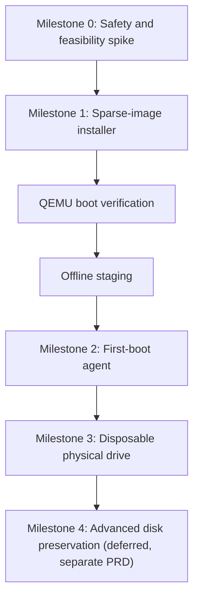

# PRD: BaselineOS Drive Setup GUI v2 — bootable install + first-boot configuration

Status: draft (revised — see §0 changelog)
Owner: Cliff Thelin
Depends on: `packaging/baseline-drive-setup/` (v1, shipped as `.deb`), `baseline/lib/handoff.py`, `baseline/bin/baseline-setup-wizard`

## 0. Revision changelog

This revision replaces the first draft after a review that found several stated guarantees the proposed mechanisms could not actually back up: device-name confirmation, "untouched on failure", chroot-validated networking, and a LAN-connect test standing in for a real inaccessibility proof, among others. Nothing about the product goal changed. What changed:

- Destructive installation is now **locked to sparse images, virtual disks, and independently-proven-disposable whole physical drives** until a defined set of milestones pass. Preserving existing partitions / installing beside existing data remains explicitly deferred, not attempted behind a checkbox.
- Device identity, storage-ancestry exclusion, and "blank drive" detection are rebuilt on signature-based, by-id-stable primitives — no reliance on `/dev/sdX` naming or mount-based inspection.
- "Failed install leaves the drive untouched" is retracted. It doesn't, and the retry contract is rebuilt around that fact.
- Phase 2 is split into offline staging (package/config staging only) vs. actual first boot on destination hardware (the only place real network/hardware facts exist) vs. post-boot verification.
- Firewall, secret-handling, and handoff-restore sections were rewritten to state only what the mechanism can actually prove, and to add the trust-tiering the previous draft was missing for private-key restoration.
- Added an explicit milestone sequence (§9) gating physical-drive writes behind image-based proof.

## 1. Problem

v1 of `baseline-drive-setup` (the `.deb`, shipped this session) solved *authorization* — a GTK4 app that picks a drive and runs a privileged helper through `pkexec`, no custom sudo, no scary install commands. It does **not** solve *installation*: `qemu-install` boots the raw Proxmox ISO with `-nographic -serial mon:stdio`, which the graphical Proxmox installer cannot drive, so nothing actually completes. Everything past drive selection — a bootable Proxmox install, the five diagnostic tools, LAN-scoped Proxmox web UI, SSH/tether preconfiguration, and handoff-packet restore — is either missing or lives in a disconnected CLI tool (`baseline-setup-wizard`) the GUI never invokes.

This PRD defines what "ready to install" actually means, and — per the review — what it *doesn't* mean yet: a production-quality installer **framework** ships first, with its destructive backend locked to image files until storage identity, boot verification, first-boot configuration, and recovery behavior are proven against those images. Physical-drive writes are the last milestone, not the first.

## 2. Governing architectural principle

> "As much of the setup process as we can should be made available while a full OS is in place, not automating CLI scripts between TUI pages." — user, 2026-09-20

Concretely: the *installer* phase should be as short and standard as possible — Proxmox's own supported unattended-install mechanism (`proxmox-auto-install-assistant` + an answer file), run to completion with zero scripted keystrokes into installer TUI/ncurses screens.

The review sharpens this further: a chroot or a QEMU session cannot truthfully stand in for the destination machine's real network and hardware. So "a full OS is in place" is now explicitly **the target's own first boot on destination hardware**, not the QEMU session or the chroot used to stage it. See §5.

## 3. Goals / Non-goals

**Goals**
- A user with an independently-proven-disposable drive (or, before that milestone, a virtual/sparse-image target) can go from "GUI open" to "drive boots Proxmox, configured" with no manual TUI navigation and no hand-typed shell commands.
- Every privileged action stays behind `pkexec` + the existing `.policy` file; the "show me the script" toggle from v1 is preserved and extended to every Phase 2 action, as a **redacted execution plan / config diff**, never a secret-bearing command line.
- Every step that can destroy data requires a stable-identity confirmation the helper independently re-verifies immediately before the destructive write — never a device-path string alone.
- Local-network-only Proxmox web UI access is the default and the only option this tool configures; the tool states precisely what it can and cannot prove about that boundary (§7).

**Non-goals (this PRD)**
- No support for installing alongside an existing OS on the same disk, preserving partitions, shrinking filesystems, dual-boot, installing into free space, or reusing an existing EFI partition. Any operation where losing the whole disk is unacceptable is **Milestone 4, explicitly deferred**, and will need its own risk model — not an extension of this one.
- No remote/headless operation of this tool over SSH — it's a local GUI, run on a machine with the target drive (or none, for image-only milestones) physically attached.
- No support for restoring a handoff packet onto a *different* Proxmox major version than it was created on (mismatch is detected and blocked, not reconciled) — and, per §8, no automatic restoration of private key material regardless of version match.

## 4. Destructive-target policy

Destructive installation (anything that can begin erasing/partitioning) is permitted **only** against:

1. Sparse/raw test image files.
2. Virtual disks (QEMU-backed).
3. A whole physical drive that has been **independently proven disposable** per §6 — not merely user-typed confirmation.

Nothing in this tool preserves existing partitions or installs beside existing data in this version. That capability is Milestone 4 and is out of scope here.

## 5. Functional requirements

### 5.1 Drive selection and stable identity

`/dev/sdX`-style paths are not authorization-grade identifiers — they're unstable across reconnection, reboot, and enumeration order changes. The GUI and helper instead key everything off:

- `/dev/disk/by-id/...` (or `by-path`/WWN where `by-id` is unavailable)
- Manufacturer, model, capacity
- Serial/WWN suffix
- Connection type (USB/SATA/NVMe)
- Existing partition-table/filesystem signatures (§5.3)
- Mounted/in-use status

The GUI's confirmation dialog reads back a human-readable identity string, e.g.:

> **ERASE Samsung T7 1TB ending 4C21**

not a bare path. The **helper independently rediscovers the device by its stable identity and re-checks capacity, serial/WWN, and storage-graph position immediately before starting the destructive operation** — it does not trust the GUI's earlier snapshot. If re-discovery finds a mismatch (different serial at that `by-id` path, capacity changed, device now has holders it didn't before), the helper refuses and requires the user to reselect from scratch.

### 5.2 Storage-ancestry exclusion (replaces "exclude the root device")

Excluding only `findmnt -no SOURCE /` is unsafe: that can resolve to an LVM LV, a dm-crypt mapping, a RAID member, or a ZFS dataset, not the physical disk underneath. The helper must resolve the **full live-system storage graph** and exclude every physical ancestor backing:

- `/`, `/boot`, `/boot/efi`
- swap
- any other mounted filesystem
- LVM physical volumes
- dm-crypt mappings
- MD RAID members
- ZFS pool members
- active loop-backed storage
- any device with holders or open dependent mappings

**If the relationship cannot be resolved with confidence, the drive is unavailable for selection — not flagged with a warning.** This is a hard exclusion, computed via `lsblk -J -o NAME,PKNAME,TYPE,MOUNTPOINT,HOLDERS`, `pvs`/`vgs`, `dmsetup deps`, `mdadm --detail`, and `zpool status`, cross-referenced, with any ambiguity resolved to "exclude."

### 5.3 "Blank drive" detection (signature-based, no mounting)

The GUI never mounts a candidate partition to check for files. "Looks like it has data" is determined entirely from read-only signature inspection:

- `lsblk` (partition table presence, children)
- `blkid` (filesystem/RAID/LVM/LUKS signatures)
- `wipefs --no-act` (every recognized signature, without touching the device)
- partition-table parsing
- LVM/RAID/ZFS membership detection (§5.2 tooling, reused here)

Any recognized partition table, filesystem, RAID marker, LVM metadata, encryption signature, or *unrecognized* signature means "contains data or previously contained data." **Only a device with zero recognized signatures, zero partitions, zero holders, and zero mounts is reported blank.** Unrecognized-but-present beats the benefit of the doubt — ambiguous reads as "not blank."

### 5.4 Milestone-gated destructive backend

The GUI's device-target abstraction has three interchangeable backends, gated by which milestone (§9) has been reached:

- **Image backend** (Milestones 0–2): a sparse file the GUI creates and QEMU treats as `-drive file=...,format=raw`. No real device involved. This is where the entire installer/first-boot/verification pipeline is built and proven.
- **Virtual-disk backend** (Milestone 1–2, same as above, naming distinction only for clarity in code): identical mechanism, used interchangeably with "image" in this document.
- **Physical-drive backend** (Milestone 3 only): everything in §5.1–§5.3, plus an exclusive device lock (`flock` on the block device, or equivalent) held for the duration of the operation so nothing else can open it concurrently, and the erase-phrase confirmation from §5.1.

Milestone 4 (non-disposable/shared drive support) is out of scope for this PRD entirely.

### 5.5 Unattended install (Phase 1)

- GUI form collects only what the Proxmox installer answer file needs: hostname, initial root password (or "generate and show once"), timezone, keyboard layout, network = DHCP. Static IP, firewall, SSH, and tether are first-boot concerns (§5.6), not baked into the installer.
- Helper subcommand `automated-install` generates a TOML answer file via `proxmox-auto-install-assistant prepare-iso`, producing a self-contained unattended ISO, then boots it under QEMU against the selected backend (§5.4) with a real display (`-vnc` or `-display gtk`), not `-nographic` — the graphical installer needs one to run unattended-but-present.
- **Failure contract:** once the installer begins, it may erase or partially rewrite the target before failing. The tool never claims the target is untouched on failure. On any failure it reports:

  > "The previous attempt may have modified this target. It is not known to be in its original state."

  A retry must: rediscover and revalidate the same stable device identity (§5.1) from scratch, display the "may have been modified" notice, and require a fresh destructive-authorization confirmation. **Retry never begins automatically.**
- Firmware mode (UEFI vs. legacy BIOS) is an explicit, recorded choice, not an accident of QEMU defaults — see §5.7 for why this matters for portability to real hardware.

### 5.6 First-boot configuration (Phase 2, split)

A chroot can stage files and install packages; it cannot observe real NIC names, the real DHCP-assigned subnet, a physical USB tether interface, real firewall behavior, real SSH reachability, or real routing — those only exist once the target hardware actually boots. Phase 2 is therefore three stages, not one:

| Stage | Runs where | Appropriate work |
|---|---|---|
| **Offline staging** | chroot into the just-installed image/drive, immediately after 5.5 succeeds | Install the five diagnostic tools (noninteractive, see §5.8), copy Baseline, stage the handoff packet's non-secret categories, seed authorized public keys, install a Baseline first-boot systemd unit that performs the next stage automatically on first real boot |
| **Actual first boot** | the target itself — real hardware, or a QEMU boot used only as a proof step (§5.7) — never claimed equivalent to real hardware | Discover real NIC names and DHCP subnet, configure the firewall rule using the *actually observed* subnet, configure tethering against the *actually present* USB interface, start Proxmox services, attempt SSH/web-UI reachability |
| **Post-boot verification** | back on the GUI-running machine, or via the first-boot unit reporting a result | Confirm the five tools installed and idle, confirm network config applied, confirm firewall state, confirm Baseline is running, confirm tty1/tty2 behavior, confirm storage/recovery paths are intact |

The GUI never claims LAN access or tethering "works" on the strength of a QEMU session or chroot alone — those claims are only made after the "actual first boot" stage reports success from the real (or real-enough, per milestone) environment.

### 5.7 Bootability verification

Two independent checks, neither one alone sufficient:

1. **Static verification** — partition table matches expectation, root filesystem/LV present, Proxmox packages installed, ESP or BIOS-boot structures present, bootloader files present, `fstab` valid, Baseline first-boot unit staged.
2. **Actual QEMU boot test** — boot from the installed target (image or, at Milestone 3, the physical drive via a QEMU passthrough proof step) and require a deterministic success marker via serial or guest-agent output, then shut down cleanly.

Firmware mode is tracked explicitly: an install run under virtual UEFI may write only to virtual NVRAM, which doesn't exist on the destination machine. The disk needs a portable/fallback EFI boot path (`/EFI/BOOT/BOOTX64.EFI` or equivalent) if it's meant to move to different hardware — this is validated as part of static verification, not assumed.

**Passing the QEMU boot test proves the disk is structurally bootable. It does not prove the destination hardware will boot it.** That claim is only made after a real first boot on the destination machine (§5.6), and the GUI's language reflects this distinction everywhere it reports success.

### 5.8 Five diagnostic tools

- Fixed set, no per-tool opt-out: `lm-sensors`, `nvme-cli`, `smartmontools`, `iperf3`, `ethtool` (the manifest from `docs/design/current-drive-inventory-plan.md` on `inventory/current-drive-manifest`).
- Installed noninteractively (`DEBIAN_FRONTEND=noninteractive`, explicit `apt-get -y`, no debconf prompts reaching a TTY that isn't there) during offline staging.
- **Service-awareness is mandatory, not incidental:** record installed package versions; explicitly verify no `iperf3` listener is enabled/running after install (it can ship an enabled systemd service depending on packaging); do not run `sensors-detect` (it's interactive-oriented and probes hardware in ways not appropriate for unattended staging); do not trigger SMART self-tests. Verify all five tools are present and correctly versioned as part of post-boot verification (§5.6), and record every package/service state change in the run summary.

### 5.9 Proxmox web UI — local-network-only

What this tool can actually prove, stated precisely:

- **"Allowed from this confirmed subnet"** — a `pve-firewall` datacenter rule permitting TCP/8006 from the detected/confirmed local subnet, covering both IPv4 and IPv6, across every active interface, with `established,related` and loopback explicitly accounted for, and SSH access and future cluster traffic (corosync etc.) not inadvertently blocked by the same policy. No rule ever references `0.0.0.0/0` or `::/0`.
- **"Denied by host policy from other sources"** — the default-deny posture the rule set implies.

What it does **not** claim: that port 8006 is globally unreachable. A successful LAN connect test proves allowed access works; it says nothing about whether something outside the LAN (a misconfigured router, UPnP, a second NIC on a different network) can still reach it. A genuine negative proof requires a probe originating from outside the allowed subnet, which this tool does not have a vantage point to run. The GUI's verification step is described honestly as "the confirmed subnet can reach it" — not "the internet cannot."

The GUI shows the **entire** proposed firewall policy before applying it (every rule, every interface, both address families) — not just the one allowed-subnet line.

### 5.10 SSH preconfiguration

- Independent of handoff restore (a user may want fresh SSH setup with nothing to restore from).
- GUI offers: paste/import a public key to seed `authorized_keys`, and a toggle for password auth (default: **disabled** once a key is present).
- If a handoff packet's public keys are also selected (§5.11), ordering is explicit and visible in the GUI: handoff-restored public keys apply first, then any keys entered in this step are appended — never silently overwritten.
- SSH **host** private keys and **user/root** private keys are handled under the stricter trust model in §5.11, not this step.

### 5.11 Tether preconfiguration

- Scope: USB tethering from a phone as a network fallback path.
- Offline staging can only *record intent* (interface alias if known from a handoff packet, preferred-vs-fallback choice) — the actual interface only exists once the real USB device is plugged into the real machine, so the config is written as a udev-matched profile and validated during the **actual first boot** stage, not offline.
- Implementation target (systemd-networkd `.network` file vs. `/etc/network/interfaces.d/` stanza) must be confirmed against what `boot/provision.sh` actually assumes elsewhere in this repo before implementation — not assumed from general Debian/Proxmox defaults.

### 5.12 Handoff packet restore, selectable from this GUI, with tiered trust

Restoring SSH host keys or private keys is materially riskier than restoring public keys and non-secret Baseline state — the previous draft treated all categories as equally "selectable," which was wrong. Revised defaults:

| Category | Default |
|---|---|
| Baseline configuration | Selectable, on by default |
| Baseline non-secret state | Selectable, on by default |
| Authorized public keys | Selectable, on by default |
| SSH host private keys | **Off** — exceptional-continuity case only, requires a second explicit warning |
| Root/user private keys | **Off** — strongly discouraged, requires a second explicit warning |
| Machine identity (`/etc/machine-id`, hostname) | **Never restored automatically** |

If both an old and new system might coexist with the same SSH host keys, they present duplicate host identities to anything that's connected to both — the second warning for host-key restoration says this explicitly, not just "this is risky."

Additional integrity requirements the previous draft was missing:
- Authenticated packet integrity (not just "decrypts successfully" — verify the archive wasn't tampered with post-encryption, e.g. AEAD or a signed manifest hash).
- Schema-version compatibility check, independent of and in addition to the Proxmox-major-version check already specified — a version match on Proxmox alone is not sufficient.
- Size limits and extraction limits (decompression-bomb protection).
- Path-traversal and symlink protection on every extracted entry before it touches the filesystem.
- Staged restoration: extract to a quarantine directory first, validate every category, and only then apply — **all categories are validated before any category is applied.**
- Exact ownership/mode validation on restored files (host keys must land as `600 root:root`, etc.) — never trust the archive's stored mode blindly.
- Rollback if application fails partway (the quarantine-then-apply staging above is what makes this possible).

### 5.13 "Show me the script" (extends v1)

Extended to cover every Phase 2 action (tool install, firewall rule, SSH config write, tether config write, handoff restore), and — per §8 — **shown output is a redacted execution plan / configuration diff, never a secret-bearing command line.**

## 6. Disposability proof (Milestone 3 gate)

A physical drive is eligible for destructive installation only once, in sequence:

1. Stable identity resolved (§5.1) and displayed to the user in human terms.
2. Zero-signature blank check (§5.3) **or** an explicit, separately-worded "I know this has data and I accept it will be destroyed" path — the tool does not treat "has data" and "is disposable" as contradictory, but it never conflates them either; a drive with data can still be confirmed disposable, it just requires the stronger of the two confirmation phrasings.
3. Full storage-ancestry exclusion passes (§5.2) with no ambiguity.
4. Exclusive device lock acquired and held.
5. Erase-phrase confirmation (§5.1's "ERASE <identity>" pattern) typed by the user, immediately before the destructive call.
6. Helper re-discovers and re-validates identity/capacity/ancestry one last time inside the privileged context, immediately before the write begins.

Any failure at any step aborts with no partial action.

## 7. Security requirements

- No hardcoded secrets. Root passwords and passphrases are never written to disk in plaintext outside a root-only `tmpfs` file at `0600`, created immediately before use and unlinked immediately after — success, failure, signal, or cancellation all reach the same cleanup path. **Passwords and passphrases are never placed on any command line** (they're visible in process listings and diagnostic output) — they cross the `pkexec` boundary via stdin/an inherited file descriptor, or the tmpfs file above only if `proxmox-auto-install-assistant`'s answer-file schema requires a path (confirm this against the tool's actual schema before implementation — do not assume it hashes the password safely on our behalf; verify).
- All GUI inputs validated against an explicit allow-list before being interpolated into any shell command or config file — hostname, subnet, interface alias.
- Every helper subcommand takes fixed positional args, never a free-form string executed as-is (as v1 already does).
- Firewall rule generation is unit-tested to never emit `0.0.0.0/0` or `::/0` (§10).
- Handoff decryption failures and manifest/schema mismatches fail closed; per §5.12, partial-apply is impossible by construction (validate-all-then-apply-all).
- Error messages / "show details" panels never leak passphrase or password values, including in stack traces and crash output.

## 8. Testing strategy (TDD)

Per the project's testing rules: 80% minimum coverage, unit + integration + e2e, red-green-refactor, AAA structure.

### 8.1 Unit tests (Python, `pytest`, `FakeRunner` pattern from `tests/unit/inventory_tests/`)

`tests/unit/drive_setup_tests/`:
- `test_answer_file.py` — TOML structure from a form dict; rejects invalid hostname/password before the validator exists (write the rejection test first).
- `test_firewall_rule.py` — generated rule never contains `0.0.0.0/0` or `::/0`; covers IPv4+IPv6, multiple interfaces, established/related, loopback; malformed/oversized subnet input raises.
- `test_storage_ancestry.py` — **root-on-plain-partition, root-on-LVM, root-on-LUKS-on-LVM, root-on-MD-RAID, root-on-ZFS-pool-member** all correctly resolve to full ancestor exclusion; a device with an unresolvable relationship is excluded, not warned-about.
- `test_blank_detection.py` — every recognized signature type (partition table, fs, RAID marker, LVM metadata, LUKS header, unrecognized-but-present) reads as "not blank"; only zero-signature/zero-partition/zero-holder/zero-mount reads as blank.
- `test_stable_identity.py` — same model+capacity but different serial is rejected as a re-discovery mismatch; a `by-id` path resolving to a different device than at selection time is rejected.
- `test_handoff_integration.py` — against `FakeRunner`/temp dir: wrong passphrase raises, manifest mismatch raises, schema-version mismatch raises, path-traversal/symlink entries are rejected before touching the filesystem, decompression-bomb-sized archive is rejected, validate-all-before-apply-all is enforced (inject a failure in category 2 of 3 and assert category 1 was never applied).
- `test_ssh_key_ordering.py` — merged `authorized_keys` preserves handoff keys first, appends new ones, no duplicates.
- `test_secret_handling.py` — assert no code path places a password/passphrase string into a subprocess `argv` list; assert the tmpfs secret file is unlinked on every exit path including simulated exception/signal.

Example (AAA):
```python
def test_firewall_rule_rejects_wildcard_subnet():
    # Arrange
    detected_subnet = "0.0.0.0/0"

    # Act / Assert
    with pytest.raises(ValueError, match="not a private subnet"):
        build_pveproxy_firewall_rule(detected_subnet)

def test_root_on_luks_on_lvm_excludes_physical_ancestor():
    # Arrange
    graph = FakeStorageGraph(root_mount="/dev/mapper/vg-root",
                              lv_backing="/dev/mapper/luks-pv",
                              luks_backing="/dev/nvme0n1p3")

    # Act
    excluded = resolve_excluded_physical_devices(graph)

    # Assert
    assert "/dev/nvme0n1p3" in excluded
```

### 8.2 Unit tests (bash helper, `bats`)
- Stable-identity re-discovery rejects a mismatched serial/capacity immediately before the destructive call — **replaces** the old v1 test that expected a matching filesystem *label*, which is incompatible with blank-drive support and is being removed.
- Every subcommand rejects a missing/malformed positional arg with no partial side effect (nothing mounted, nothing written) before validation completes.
- Exclusive lock acquisition failure (device already held) aborts cleanly.

### 8.3 Integration tests
- Full Phase 1 against a throwaway sparse image: answer-file generation → unattended install → static verification → QEMU boot test passes. Budgeted as a slower pre-release check, not per-commit.
- Offline staging against the resulting image via chroot: five tools installed, no stray `iperf3` listener, Baseline first-boot unit staged.
- Actual-first-boot stage, run inside a QEMU VM (proof-of-concept for the "real boot" stage, understood as *not* equivalent to real hardware — see §5.6): confirm NIC discovery, firewall rule using the observed subnet, SSH reachable with seeded key, password auth rejected.
- Interrupted-run recovery: kill the process mid-install, mid-staging, and mid-first-boot; assert each resumes only via a fresh, explicit authorization — never automatically.

### 8.4 E2E (GUI)
- Controller/model layer tested directly via `pytest` (GTK widget code kept thin per the container/presentational split), plus one `Xvfb` smoke test: open window, walk drive picker, confirm "Authorize & Build" enables only after the exact erase-phrase (§6.5) is typed — not a bare path string.

### 8.5 Additional cases from review
- Device path changes between GUI selection and authorization (simulate reordering) — must be caught by stable-identity re-discovery, not by path comparison.
- Same model/capacity, different serial — rejected.
- USB disconnect/reconnect mid-install — detected, aborts, requires fresh authorization.
- Automounter interference (something auto-mounts a partition mid-operation) — detected via lock/holder check.
- Cancellation before vs. after the first destructive write — both leave the tool in the "may have been modified" state from §5.5, never silently treated as clean.
- QEMU crash after partitioning begins — same "indeterminate state" contract.
- UEFI install with no portable fallback EFI entry — static verification catches it, not discovered only on real hardware.
- Multiple active LAN interfaces present — firewall rule covers all of them, not just the first discovered.

### 8.6 Coverage target
80% minimum across `baseline/lib/handoff.py`, the new storage-ancestry/blank-detection/stable-identity/answer-file/firewall-rule/ssh-merge modules, and the bash helper's validation logic. GUI widget wiring is exempted from the numeric target (thin by design, covered by the one `Xvfb` smoke test) — the smoke test supplements the model tests, it does not replace them.

## 9. Recommended implementation sequence



### Milestone 0 — Safety and feasibility spike
No physical block-device writes of any kind. Prove:
- The exact `proxmox-auto-install-assistant` answer-file format, and whether it accepts a password hash or requires a plaintext path.
- Secure secret delivery mechanism actually works end-to-end (tmpfs file, permissions, cleanup-on-every-exit-path).
- ISO signature/checksum verification.
- Whether `proxmox-auto-install-assistant` can run on this Ubuntu 26.04 development host at all — unresolved from earlier this session, likely needs a minimal Debian chroot/systemd-nspawn without Docker; get a real answer here before Milestone 1 starts.
- QEMU firmware/boot-mode behavior (UEFI NVRAM vs. portable fallback path).
- Complete storage-ancestry detection logic against real LVM/LUKS/RAID/ZFS test fixtures.
- Exclusive target locking mechanism.
- Cancellation semantics at every stage.
- Prepared-ISO cleanup (nothing left behind in `/tmp` or elsewhere with secrets embedded).

### Milestone 1 — Virtual disk installation
Sparse image files only. Prove: ISO preparation, automated installation, failure handling (the "indeterminate state" contract), static filesystem verification, actual QEMU boot test, Baseline first-boot unit staging, logs and redaction.

### Milestone 2 — First-boot configuration
Run on an actual booted Proxmox VM (still virtual, but now testing the "actual first boot" stage's logic, not just staging). Prove: diagnostics installation and service-awareness (§5.8), web UI firewall behavior against observed (virtual) network facts, SSH configuration, tether profile generation logic, handoff transactional restoration (§5.12), idempotent reruns, recovery after interrupted configuration.

### Milestone 3 — Whole disposable physical drive
Only after 0–2 pass. Require: stable by-id identity, full storage-ancestry exclusion, no mounts/swap/holders/RAID/LVM/ZFS membership, exclusive device lock, fresh pre-destruction revalidation, explicit erase phrase, no automatic retries, and — because this is the first point real hardware is involved — a real first-boot-on-destination-hardware test before the tool ever declares the overall process complete.

### Milestone 4 — Non-disposable or shared drive
Explicitly deferred. Preserving partitions, shrinking filesystems, dual-boot, installing into free space, reusing an existing EFI partition, or any operation where losing the whole disk is unacceptable. Needs a different risk model and likely a separate installer mode — not an extension of this one.

## 10. Acceptance criteria

- No code path can write to a physical drive before Milestone 3 is reached; the Milestone 0–2 test suites enforce this structurally (image/virtual backend only), not by convention.
- A user targeting the currently-running OS's storage — at any depth of LVM/LUKS/RAID/ZFS — cannot select it; the tool does not merely warn.
- Every destructive action requires a typed erase-phrase naming a stable, helper-reverified device identity — never a bare path.
- A failed Phase 1 run never claims the target is untouched, and never retries without fresh, explicit, re-validated authorization.
- Firewall claims are worded to match what was actually tested: "allowed from the confirmed subnet, denied by host policy elsewhere" — never "globally unreachable" without an external-vantage-point probe backing it.
- SSH host keys and private keys are never restored from a handoff packet without an explicit, separately-worded second confirmation; public keys and non-secret state restore normally.
- No secret value ever appears in a command-line argument, environment dump, log, or crash report; "show me the script" output is redacted by construction.
- Every privileged action is inspectable via "show me the script" before it runs.
- All new logic in §8.1–8.3 has tests written first and passing, at ≥80% coverage on the modules listed in §8.6.

## 11. Open risks / explicit unknowns to resolve at Milestone 0

- Whether `proxmox-auto-install-assistant` is obtainable/runnable on this Ubuntu 26.04 desktop without Docker.
- Whether Proxmox base install omits NetworkManager (assumed for §5.11) — confirm against a real installed system.
- The actual answer-file schema's handling of the root password (hash vs. plaintext path) — drives the final shape of §7's secret-delivery mechanism.
- Whether this session's QEMU raw-disk-passthrough capability against a *real* device (Milestone 3 only) needs to be re-confirmed with the user at that point — it should be, explicitly, even though the mechanism (pkexec + audited helper) doesn't change from v1.
