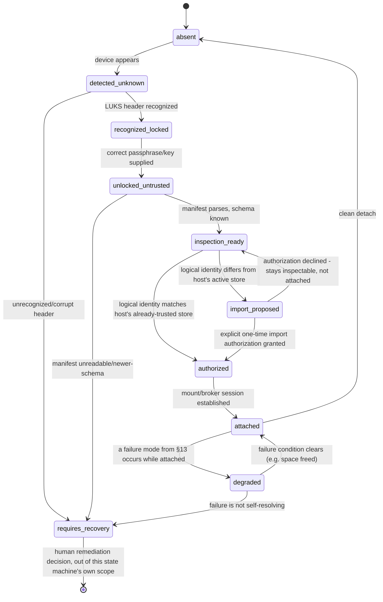

# PRD: TestPersistence — synthetic persistent-storage architecture experiment

Status: draft, design-only. No implementation in this pass.
Owner: Cliff Thelin
Depends on: nothing - self-contained synthetic experiment.
Blocked by: nothing. Explicitly **not** blocked by the pending real-world identity-scan gate (see [physical-phase-p0-p1-plan.md](physical-phase-p0-p1-plan.md)'s `identity_scan: pending_operator_verification`) - that gate concerns this repository's own tracked content/history for real-world identifiers, and TestPersistence never introduces any (see §0).

## 0. Scope and synthetic-data discipline

TestPersistence is a design exercise, and eventually a QEMU-only experiment, for how Baseline should separate ephemeral substrate from durable person/application state - the identity model that lets a logical store survive hardware replacement, the attachment state machine that governs how a store earns trust, and the access broker that keeps applications and guests away from the raw block device. It is entirely independent of the real Physical Phase P0/P1 work: no physical hardware, no `/dev/sdX`, no real person data, no cloud accounts, no privilege escalation, no LUKS invoked in this pass.

**Every identifier anywhere in this document, and every fixture/test/example this PRD's later milestones produce, is synthetic**, drawn from this fixed set (extend the pattern, never depart from it):

`TestPerson-001`, `TestPersistence` / `TestPersistence-001`, `TestSystem-A`, `TestSystem-B`, `TestApplication-A`, `TestApplication-B`, `TestDocuments`, `TestMemory`, `TestGrant-001`, `TestPersistenceDisk-001`.

No real name, hostname, serial number, email address, or any other real-world identifier may appear in this PRD, its tests, its fixtures, or any evidence it produces. This is a structural property of the experiment (§6's `test_only: true` manifest field is the machine-checkable version of this same rule), not merely a writing convention - see acceptance case 20 (§14).

## 1. Problem

Baseline's current model treats the whole boot drive as one thing: `provision.sh` rebuilds it wholesale, and nothing distinguishes what's safe to discard from what must survive. As soon as Baseline needs to preserve a person's data and preferences, and applications' own state, independently of a disposable, freely-rebuildable substrate OS, several different lifetimes get conflated that must not be:

- the substrate itself (freely destroyable, exactly what `provision.sh` already rebuilds today),
- Baseline's own control-plane state (its journals, its own service state, its own ledgers),
- a person's persisted data and preferences, and
- an application's own persisted state, which may or may not reference person data.

There is currently no separation between these, no identity model distinguishing a specific physical drive from the logical store that might legitimately migrate to replacement hardware, and no access-control layer preventing an application or guest from simply reading the raw persistence volume and its encryption key.

This PRD defines, at a design level only, the storage-class taxonomy, identity model, bootstrap-trust rules, initial (experiment-scoped) storage design, attachment state machine, access broker, OS-overlay classification, application lifecycle, snapshot/recovery semantics, secrets and AI-memory handling, failure behavior, and a synthetic acceptance matrix - all of it needed before any of this is implemented against real hardware or real data.

## 2. Non-goals (this PRD)

- No implementation of storage, no disk image creation, no LUKS invocation, no privilege requests - schema and state-machine design plus pure unit tests only, and only starting at Milestone 2 of §16's sequence, not in this document itself.
- No physical drive, no `/dev/sdX`, no real WWN/serial - synthetic QEMU virtual disks only, and only starting at Milestone 3 of §16, not here.
- No real person data, no real application data, no cloud credentials, no network dependency.
- No dependency on, or blocking by, the pending real-world identity-scan gate - see §0.
- Final filesystem selection for what lives atop the experiment's LUKS2 volume is explicitly deferred (§6).
- Cloud backup (Google Drive or any other provider) is optional future work, not built, stubbed, or connected here (§15).
- No GUI work, no Proxmox capability adapter, no Harvester evaluation - this PRD is planning documentation only.

## 3. Storage classes

| Class | What it is | Rebuild/lifetime policy | Migrates with hardware swap? |
|---|---|---|---|
| 1. Disposable substrate | The OS Baseline runs on top of - matches `provision.sh`'s existing rebuild model exactly | Freely destroyable/rebuildable at any time without consulting persistence | No - regenerated fresh on new hardware |
| 2. Baseline control-plane state | Baseline's own operational data: journals, its own service state, its own ledgers (§9, §11) | Not disposable, but not the same namespace as person/application state - a Baseline reinstall must be able to deliberately inherit or rebuild this, never accidentally | With the logical store (§4), not the substrate |
| 3. Person persistence | One person's documents and preferences (`TestDocuments`) - the application-agnostic profile a person owns | Durable; survives substrate rebuild and application reinstall | With the logical store |
| 4. Application persistence | One application's own state, independent of any one person (may reference person-scoped data only via a grant, §8) | Durable by default; explicit `delete state` (§10) required to remove it | With the logical store |
| 5. Secrets | Credentials and keys | Always its own separate vault namespace (§12); never comingled with person/application persistence even though it lives on the same logical store | With the logical store |
| 6. Cache/scratch | Ephemeral working data any component can regenerate | Explicitly allowed to be lost; never backed up; never migrated; first dropped under storage pressure | No |

Classes 2-6 all live inside the one encrypted `TestPersistence` volume in this experiment's initial storage design (§6), but remain structurally separated namespaces within it - never comingled just because they share a volume.

## 4. Identity model

> Identity is a body of time-scoped evidence, never one identifier.

Four relations must be distinguished explicitly, and never conflated:

- **Equivalence** - two evidence sets describe the same real store.
- **Continuity** - the same store legitimately evolved forward in time (a new snapshot, an expected generation-counter increment).
- **Ownership** - which authority (a person, via a grant) is entitled to open the contents.
- **Authorization** - whether *this* host/session presently holds a valid grant to act, right now.

Evidence layers are preserved **separately**, never merged into one identifier:

- **Physical device identifiers** - WWN, serial, model, capacity. Real evidence, meaningful only while literally attached to real hardware; synthetic-only (`TestSystem-A`/`TestSystem-B`-scoped fake values) in this experiment.
- **GPT/partition identifiers** - disk GUID, partition GUID.
- **LUKS identifiers** - LUKS UUID, key-slot metadata, header generation counter.
- **Filesystem identifiers** - filesystem UUID/label.
- **Logical store identity** - Baseline's own concept, a `TestPersistenceDisk-001`-style identifier recorded *inside* the encrypted manifest itself (§6), never derived from any layer below it.

`/dev/sdX` (or `/dev/vdX` in QEMU) is an **attachment alias only** - never persisted as identity anywhere, never compared for equality, re-derived fresh on every attachment.

Real WWN/serial/model/capacity evidence **travels with physical hardware**: when a physical drive is genuinely swapped, that evidence changes accordingly, and Baseline must not expect it to stay constant across a hardware swap, nor treat a hardware-evidence change alone as proof of anything about the logical store's own identity.

**Logical store identity is designed to survive an authorized migration to replacement hardware.** The same person/application persistence - verified via the internal manifest's own logical identifier plus continuity evidence (the generation counter, the prior-attachment ledger, §9) - can be recognized as "the same store" even though WWN, serial, LUKS UUID, and filesystem UUID all changed because the physical medium changed. This is the crux of the whole model: hardware identity and logical identity are independent axes, checked independently, never inferred from one another.

**Conflicting evidence produces an explicit ambiguous/refusal state** - e.g. a logical identifier matches but the LUKS generation counter doesn't correspond to any previously-recorded generation, or two attached stores both claim the same logical identifier (a cloned volume, §13). This is never resolved by a best guess; it routes to `requires_recovery` (§7) with the conflict described, for a human decision.

## 5. Bootstrap trust

- **Fresh Baseline installation** - no persistence store exists yet. Baseline offers to create one (§6's two-virtual-disk design). This is the only path that creates a brand-new logical identity.
- **Encrypted existing store** - a store with a locked LUKS volume is attached. Baseline can read some evidence (GPT/LUKS UUIDs) but not the internal manifest until unlocked; stays in a locked/inspection-limited state (§7).
- **User-held recovery authority** - the passphrase/keyfile/recovery mechanism is held only by the person, never auto-derived from machine state, never cached beyond what one unlock operation needs without explicit, separately-designed configuration.
- **Explicit local import authorization** - attaching a store belonging to a *different* logical identity than the host's currently-active one requires an explicit, described, one-time authorization step (the `import_proposed` state, §7) - never silent, never inferred from mere attachment.
- **No automatic inheritance of machine-specific trust** - a grant, credential, or trust decision tied to one physical host/session is never silently extended to a different host/session just because the same store is attached there. Re-establishing trust on new hardware is itself an explicit, ledgered event (§9).
- **Cloned-store detection** - two attachments presenting identical logical-identity evidence (e.g. a byte-for-byte cloned LUKS volume) is a distinguishable, explicit failure state (§13), detected via generation-counter/attachment-ledger divergence, never resolved by arbitrarily picking one.

## 6. Initial storage design (this experiment's own scope)

- **Two virtual disks**: `disposable-system` (the substrate, class 1, freely rebuildable) and `TestPersistence` (the encrypted, retained store - classes 2 through 6, combined behind one volume for this experiment).
- **LUKS2** is the encryption engine for *this experiment specifically* - not a production commitment, chosen so the attachment state machine (§7) can be proven against a real (if synthetic) encrypted volume.
- **Independently versioned internal manifest** - the manifest living inside the encrypted volume carries its own `schema_version`, separate from Baseline's own software version and separate from the outer LUKS/GPT/filesystem versions, so a manifest can be read and migrated independently of whatever Baseline build currently runs.
- **Mandatory `test_only: true`** at the top of every manifest this experiment produces - a structural, machine-checkable guard. A real manifest reader should refuse anything without this flag correctly set for its intended context, so nothing this experiment generates could be mistaken for production data even if a file escaped its sandbox.
- **Separated namespaces** within the manifest: `person`, `preferences`, `application_state`, `grants`, `authority_ledger`, `secrets`, `snapshots`, `quarantine` - each its own top-level namespace, never comingled, mirroring §3's class separation and enforced structurally in the schema, not merely by convention.
- **Final filesystem selection** for what lives atop the LUKS2 volume (ext4, btrfs, zfs, or something else) is explicitly **deferred** - this PRD does not commit to one. Milestone 3 (§16) may use whatever is simplest to prove the state machine; that choice is not a production decision.

**Illustrative manifest shape** (synthetic values only, for schema discussion - not a committed format):

```json
{
  "schema_version": 1,
  "test_only": true,
  "logical_identity": "TestPersistenceDisk-001",
  "generation": 1,
  "created_at": "2026-09-24T00:00:00Z",
  "namespaces": {
    "person": {"TestPerson-001": {"documents_ref": "TestDocuments"}},
    "preferences": {},
    "application_state": {"TestApplication-A": {}, "TestApplication-B": {}},
    "grants": {"TestGrant-001": {"person": "TestPerson-001", "application": "TestApplication-A",
                                   "collection": "TestDocuments", "access_mode": "read",
                                   "duration": "until_revoked", "authorized_by": "bootstrap"}},
    "authority_ledger": [],
    "secrets": {},
    "snapshots": [],
    "quarantine": {}
  }
}
```

## 7. Attachment state machine

**Governing invariant: detection must never automatically unlock, import, migrate, format, or attach writable.** Every state below that could plausibly be mistaken for an all-clear is explicitly read-only-of-metadata until a human or an already-established authorization advances it.



| State | Meaning | What's readable | What's writable |
|---|---|---|---|
| `absent` | No device present | Nothing | Nothing |
| `detected_unknown` | A device appeared; not yet identified as LUKS/Baseline-shaped | Raw block presence only | Nothing |
| `recognized_locked` | A LUKS2 header is recognized; volume not yet unlocked | GPT/LUKS UUIDs only | Nothing |
| `unlocked_untrusted` | Passphrase/key accepted; manifest not yet validated | Raw volume content, unvalidated | Nothing consequential |
| `inspection_ready` | Manifest parses under a known `schema_version` | Full manifest, read-only | Nothing |
| `import_proposed` | Logical identity differs from this host's active store | Manifest (already read in `inspection_ready`) | Nothing - waiting on an explicit decision |
| `authorized` | This host holds a valid authorization for this logical identity | Manifest | Nothing yet - not mounted |
| `attached` | Broker session established (§8) | Whatever the current grants permit | Whatever the current grants permit |
| `degraded` | Attached, but a §13 failure mode is active | Depends on the failure mode | Depends on the failure mode - never silently full read-write |
| `requires_recovery` | A conflict or corruption this state machine cannot resolve itself | Diagnostic evidence only | Nothing |

## 8. Access broker

- **Only Baseline mounts the underlying store.** Guests (VMs) and applications never receive the raw block device or the encryption key - they only ever see whatever Baseline's broker exposes, scoped by an active grant.
- **Grants** identify: **person** (or `null` for application-only state), **application**, **collection** (which namespace/subtree), **access mode** (read / write / read-write, or a more granular future scheme), **duration** (time-boxed or until-revoked), and **authorization** (which `authority_ledger` entry approved it). `TestGrant-001` in §6's example manifest shows the shape.
- **Revoking a grant removes access, never deletes data.** The underlying namespace content is untouched by a revocation.
- **No access is ever inferred merely from a matching OS/guest username.** A guest-OS username that happens to equal a person's synthetic identifier is not implicit authorization; only an entry in `grants`, backed by an `authority_ledger` record, grants access.

## 9. OS overlays

Three classes of settings that might otherwise be carried across a substrate rebuild or a hardware migration - never treated interchangeably:

- **Portable settings** - safe to always carry forward (e.g. an application's user-preference toggle). Copied without an adapter.
- **Compatibility-gated settings** - carried forward *only* if an explicit adapter confirms the source and destination versions/environments are compatible (e.g. a setting whose valid values depend on an application version). Never applied blind.
- **Machine-specific settings** - must never automatically transfer (e.g. a display resolution, a hardware device path, a network interface name). Explicitly regenerated on the new machine, never carried forward even coincidentally.

**Adapter/version requirements**: a portable-settings importer must declare which schema versions it accepts, and refuse - not best-effort-convert - anything outside that declared range. This matches this project's existing fail-closed-on-unknown discipline (the handoff journal in `drive-setup-gui-v2-prd.md`, `firstboot_statemachine.py`'s corrupted-journal handling).

## 10. Application lifecycle

| Operation | Application state (class 4) | Referenced person data (class 3, via grant) |
|---|---|---|
| install | Created fresh | Unaffected (no grant yet) |
| disable | Retained, application inactive | Grants remain valid but unused |
| re-enable | Restored to active | Grants resume effect |
| upgrade | Migrated per §9's adapter rules | Unaffected |
| rollback | Reverted to a prior application-state snapshot (§11) | Unaffected - never rolled back by an application rollback |
| clone | A new, independent application-state copy created | New grants required - not inherited automatically |
| move | Reassociated to a different logical store via authorized import (§5) | Grants re-authorized on the destination, not carried blind |
| uninstall | **Retained by default** - moved to a "retained, uninstalled" sub-state | Grants remain until separately revoked |
| retain state | (the default outcome of uninstall - named explicitly so it's a decision, not an accident) | Unaffected |
| delete state | Application state moved to `quarantine` (§6) for a retention window, then actually removed | Grants explicitly revoked as part of this operation |
| export | Application state (and, if explicitly requested, grant-referenced data) serialized out | Only included if explicitly requested - never bundled silently |
| import | Application state restored, re-authorized against the destination's grants | Grants re-established explicitly, not inherited |

**Uninstall must not delete persistence by default.** Only the separate, explicit `delete state` operation removes application persistence, and even then it first passes through `quarantine` rather than disappearing immediately.

## 11. Snapshot and recovery semantics

- **System rollback must not roll person data backward.** Rolling back the disposable substrate (class 1) or Baseline's own control-plane state (class 2) is independent of the `TestPersistence` store's own timeline - the two are never snapshotted or rolled back as one atomic unit by default.
- **Application rollback is scoped to application state.** Rolling `TestApplication-A` back to a previous version's state must not touch `TestApplication-B`'s state or any person data outside the grants `TestApplication-A` itself held at that point.
- **Revoked grants cannot silently return through snapshot restoration.** Restoring an older snapshot of the `grants`/`authority_ledger` namespaces must not resurrect a grant explicitly revoked after that snapshot was taken - restoration is checked against the *current* authority ledger's revocation records, never blindly applied.
- **Restoration creates a new ledger event.** Every snapshot restore is itself recorded as a new, forward-moving `authority_ledger` entry - never an edit to history in place - matching this project's established durable, append-only journal discipline (`setup_intent.py`'s consumption ledger, `firstboot_statemachine.py`'s journal).

## 12. Secrets and AI memory

- **Secrets remain in a separate vault namespace** (class 5, §3) - structurally separate storage, never readable through the same access path as person documents or application exports.
- **`TestMemory`** - a synthetic stand-in for a future AI-harness memory concept - is its own separate collection, carrying explicit **provenance** (what produced each entry) and **retention** (how long it's kept, whether it expires) metadata. It is never silently folded into "ordinary documents."
- **Neither secrets nor `TestMemory` are ever included in a plain "export this person's documents" operation.** An export must explicitly opt into including secrets or memory, and such an export is itself a distinctly-labeled, ledgered operation (ties to §8's grant/authorization framing).

## 13. Failure behavior

| Failure mode | What Baseline detects | Degraded-boot behavior |
|---|---|---|
| Missing | Store was previously attached but isn't present now | Explicit tty1 message; no auto-recreate of an empty replacement |
| Locked | LUKS present, not yet unlocked | Normal, expected pre-authorization state (§7) - not itself a failure, but persistence unavailable until unlocked |
| Unknown | Attached, but no recognizable Baseline manifest | Stays at `inspection_ready` at most; never auto-formatted |
| Cloned | Identity-evidence collision (§4/§5) | Explicit ambiguous-identity report; refuses to pick one |
| Corrupted | A namespace fails its own internal consistency check | Explicit corruption report; refuses to silently drop the damaged namespace |
| Read-only | Underlying medium/filesystem is read-only | Documented read-only mode; writes refused explicitly, never silently discarded |
| Full | No space left for a write | Write refused explicitly; never silently truncated or dropped |
| Newer-schema | Manifest's `schema_version` is newer than this Baseline build understands | Refuses to guess-parse; explicit "needs a newer Baseline" message; never partially interprets an unrecognized schema |

**No silent creation of an empty replacement store.** Under any failure mode above, Baseline must never auto-create a fresh, empty `TestPersistence`-shaped store as if that were normal recovery - doing so would silently destroy the ability to recognize the real store if it's later found, and could mask real data loss as if nothing had happened. Every failure mode above routes toward `requires_recovery` (§7) for an explicit human decision, not an automatic one.

## 14. Twenty-case acceptance matrix

| # | Scenario | Systems | Expected outcome |
|---|---|---|---|
| 1 | Fresh creation | `TestSystem-A` | `disposable-system` + `TestPersistence` created; logical identity assigned; manifest carries `test_only: true` |
| 2 | Person data + preference write, immediate readback | `TestSystem-A` | `TestPerson-001`'s `TestDocuments` and preferences written and read back correctly |
| 3 | Application install + grant + state write | `TestSystem-A` | `TestApplication-A` installed, `TestGrant-001` issued to `TestPerson-001`, app state written |
| 4 | **Destruction/replacement of the disposable system disk only** | `TestSystem-A` | `disposable-system` rebuilt (simulating `provision.sh`); `TestPersistence` untouched; reattach shows expected continuity (generation counter unchanged aside from a normal increment) |
| 5 | **Recovery on a different system** | `TestSystem-A` → `TestSystem-B` | `TestPersistence` detached from A, attached to B (different synthetic hardware identity); same logical identity recognized despite different WWN/serial; explicit import authorization required and granted |
| 6 | Attach without authorization | `TestSystem-B` | Stays at `import_proposed`; never silently attaches |
| 7 | **Application isolation** | `TestSystem-A` | `TestApplication-A` cannot read `TestApplication-B`'s namespace, even though both are attached under the same store |
| 8 | **Grant revocation** | `TestSystem-A` | `TestGrant-001` revoked; access denied afterward; `TestDocuments` still present |
| 9 | Revoked grant does not return via snapshot restore | `TestSystem-A` | Restoring a snapshot taken *before* case 8's revocation does not resurrect access; a new ledger event is recorded |
| 10 | **Missing-store boot** | `TestSystem-A` | Boots with `TestPersistence` physically absent; degraded state; explicit message; no auto-recreate |
| 11 | **Read-only behavior** | `TestSystem-A` | `TestPersistence` attached read-only (simulated); writes refused explicitly; reads succeed |
| 12 | Full-store behavior | `TestSystem-A` | Small synthetic volume filled to capacity; further writes refused explicitly; no silent truncation |
| 13 | Corrupted manifest | `TestSystem-A` | One namespace's data intentionally corrupted; Baseline reports corruption; does not drop or ignore it |
| 14 | Newer-schema refusal | `TestSystem-A` | Manifest declares a `schema_version` newer than this build understands; refuses to parse; explicit message |
| 15 | **Clone detection** | `TestSystem-A` + a byte-identical copy | Two attachments present identical logical-identity evidence; ambiguous/refusal state; no silent pick-one |
| 16 | **Application rollback without person-data rollback** | `TestSystem-A` | `TestApplication-A` rolled back one version; `TestPerson-001`'s documents and `TestApplication-B`'s state unaffected |
| 17 | System rollback without person-data rollback | `TestSystem-A` | `disposable-system` rolled back to an earlier snapshot; `TestPersistence`'s own timeline untouched |
| 18 | Uninstall retains state by default | `TestSystem-A` | `TestApplication-A` uninstalled; state retained (not deleted); separate `delete state` operation actually removes it, via `quarantine` |
| 19 | Portable vs. machine-specific settings on export/import | `TestSystem-A` → `TestSystem-B` | Portable preferences transfer; machine-specific settings (§9) do not, even though the same logical store is now on different synthetic hardware |
| 20 | **Complete absence of real identifiers** | All of the above | Every fixture, manifest, log, and retained artifact this experiment produced is scanned; only the declared `TestX-NNN`-pattern synthetic identifiers appear anywhere |

## 15. Cloud boundary

- **Local encrypted persistence is authoritative.** The `TestPersistence` LUKS2 volume (or its production equivalent) is always the source of truth.
- **A cloud provider is optional, later work** - Google Drive named only as one example, not a commitment - positioned strictly as a **client-side-encrypted backup replica**. Baseline would encrypt before anything leaves the local store; the cloud side never receives a decryption capability Baseline doesn't explicitly grant, and the cloud copy is never itself authoritative. A conflict between local and cloud state always favors local, or requires explicit human reconciliation - never silent cloud-wins.
- **No cloud credentials and no network dependency of any kind in this experiment.** This section is future-facing design intent only - not built, not stubbed, not connected to a real endpoint.

## 16. Milestone sequence

1. **PRD approval** - this document, reviewed and accepted before any code.
2. **Pure schema/state-machine unit tests** - dataclasses/enums for the storage classes, identity model, attachment state machine, and grant records, fully unit-tested with no disk I/O, no LUKS, no QEMU - matching this project's existing "parsing stays pure" discipline (`ifnet_config.py`'s own module docstring).
3. **Two-disk QEMU experiment** - `disposable-system` and `TestPersistence` actually created and booted, proving the attachment state machine against a real (if synthetic) LUKS2 volume for the first time.
4. **Destroy/rebuild/reattach proof** - acceptance case 4: `TestSystem-A`'s disposable-system disk destroyed and rebuilt while `TestPersistence` is preserved and correctly reattached.
5. **Application grant proof** - acceptance cases 3, 7, 8: a real (synthetic) `TestApplication-A`/`TestApplication-B` pair, grants issued and revoked, isolation verified end-to-end.
6. **Failure matrix** - the eight failure modes (§13) exercised for real against the QEMU experiment, not just unit-tested.
7. **Later, separate physical-drive experiment** - explicitly deferred, its own future PRD and milestone, not started here and not implied to be imminent.

Milestones 3 onward are the first point at which this PRD's scope touches QEMU at all; nothing before Milestone 2 exists as code. None of these milestones begin in this pass.

## 17. Open questions

- Final filesystem choice for the volume atop LUKS2 (§6) - deferred past this PRD.
- Exact grant-record encoding (a flat JSON object as sketched in §6, vs. a more structured/versioned form) - to be settled when Milestone 2's schema is actually written.
- Whether the attachment state machine (§7) needs a formal specification language, or stays as documented Python enum-plus-tests, as this project's other state machines do (`firstboot_statemachine.py`).
- Whether `TestMemory`'s retention policy (§12) needs a per-entry TTL or a single collection-wide policy - affects the schema, not the architecture.
- Whether "application rollback" (§10/§11) needs its own generation counter independent of the store's overall generation counter (§4), to let two applications roll back independently without interfering with each other's continuity evidence.
